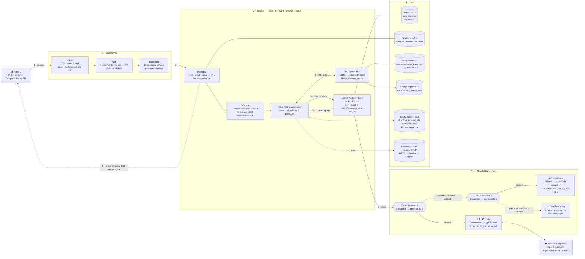

# Архитектурный паспорт проекта multapi

Ассистент технической поддержки продукта «Личный кабинет»: отвечает на вопросы пользователей, сам вызывает инструменты (поиск по руководству, статус сервиса), разбирает скриншоты и голосовые сообщения. Паспорт описывает целевую архитектуру на ближайшие модули курса: асинхронный клиент появился в Б3.3, HTTP-сервис на FastAPI с кешем в Redis — в Б3.4, в Б3.5 он упакован в Docker вместе с Redis, на него навешивается observability в Б3.6, к Service-слою подключается Telegram-бот в М4, а Data-слой получает RAG в М5.

Обозначения: ✅ — уже реализовано в репозитории, 🔜 — план, рядом указан блок курса. ⚡ — latency-критичный вызов (пользователь ждёт ответа), 💰 — cost-критичный (важнее цена, чем скорость).

## 1. Контекст и цифры нагрузки

Расход токенов взят из реальных прогонов блока 3.1 (`logs/tool_calls_sample.jsonl`): запрос с вызовом инструмента — 2 обращения к LLM и около 2,3K токенов, без инструмента — 1 обращение и около 1,05K токенов. Объёмы трафика — допущение для внутренней поддержки SaaS-продукта среднего размера.

| Параметр | Значение | Как получено |
|----------|----------|--------------|
| Пользователи | ~300 в день | допущение |
| Сообщения | ~500 в день, пик 20 в минуту | допущение, рабочий день 10 ч |
| RPM к LLM | в среднем ~2, в пике ~50 | на сообщение 1,6 вызова ассистента (60 % — с инструментом) + 1 вызов классификатора |
| TPM | в пике ~40K | 20 сообщений/мин × ~2K токенов |
| Средний ответ | 50–100 токенов (до 3 предложений, 300–500 символов) | замер Б3.1: 21–96 completion-токенов |
| Токены в сутки | ~1M (≈0,93M input + 0,07M output) | 500 × ~2K |
| Бюджет | расчётно ≈ $0,15–0,2 в день на primary, лимит — $1 в день | `gpt-4o-mini`: $0,15 / $0,60 за 1M токенов |
| Cache hit rate | цель ≥ 20 % | повторяющиеся вопросы-FAQ («как сбросить пароль») |
| Латентность | primary: первый токен ≤ 1,5 с, ответ целиком ≤ 6 с; fallback: до 60 с | замер Б3.1 на локальном Ollama: 18–50 с на шаг |

| Вызов | Тип | Куда | Таймаут |
|-------|-----|------|---------|
| Ответ ассистента (цикл tool_call) | ⚡ | Primary → Fallback → Template | 30 с облако, 180 с локально |
| Классификатор обращений | 💰 | дешёвая модель (`llama3.2` локально) | 60 с |
| Анализ скриншота (vision) | 💰, тяжёлый | vision-модель | 120 с |
| Голос: Whisper и TTS | 💰 | аудио-эндпоинт OpenAI (опционально) | 60 с |
| Индексация базы знаний (М5) | 💰, пакетный | эмбеддинги, офлайн | — |

## 2. Схема компонентов

Поток одного запроса:
1. Клиент отправляет сообщение; nginx завершает TLS и передаёт запрос дальше.
2. Gateway проверяет токен и лимит сообщений пользователя.
3. Сервис проверяет кеш: при попадании ответ отдаётся сразу.
4. При промахе запрос идёт в LLM-слой по цепочке fallback: каждый провайдер закрыт своим Circuit Breaker; если оба недоступны — отвечает шаблон без генерации.
5. Если модель вызывает инструменты, сервис выполняет их (чтение базы знаний и статуса) и снова обращается к модели.
6. Финальный ответ идёт клиенту потоком (SSE) и сохраняется в кеш; каждый шаг пишется в лог.

## 3. ADR-001: Выбор паттерна взаимодействия

**Status:** Accepted (2026-10-06)

**Context.** Ассистент техподдержки продукта «Личный кабинет»: интерактивный чат (CLI сейчас, Telegram-бот в М4) с вызовом инструментов и редкие тяжёлые запросы — скриншоты и голос. Нагрузка — до 20 сообщений в минуту в пике (~50 RPM и ~40K TPM к LLM). Ответ короткий: до 3 предложений, 50–100 токенов. Сообщение с инструментом требует двух последовательных вызовов LLM: выбор инструмента и итоговый ответ. На облачном primary это 2–5 с, а в режиме fallback на локальном Ollama — 20–60 с (замер блока 3.1).

**Decision.** Выбран **Streaming через SSE** (`POST /chat/stream`) для итогового ответа. Шаги tool_call выполняются на сервере обычными запросами к модели, и клиент в это время видит статус («Проверяю статус сервиса…»). Затем токены финального ответа идут потоком. Telegram-бот обновляет сообщение по мере прихода токенов (edit-message, не чаще раза в секунду). Ответы из кеша отдаются сразу целиком.

**Consequences.**
- Плюсы: реакция видна за 1–1,5 с даже в медленном режиме fallback; одна модель взаимодействия для бота и CLI; совпадает с ручкой `/chat/stream`, реализованной в Б3.3.
- Минусы: в nginx нужно отключить `proxy_buffering` и увеличить `proxy_read_timeout`. Переключиться на fallback можно только до первого токена — обрыв посреди потока превращается в сообщение об ошибке. Учёт токенов в потоке требует `stream_options.include_usage`, а Telegram ограничивает частоту редактирования сообщений.

**Alternatives.**
- Request-Response — отвергнут как основной: проще, но в режиме fallback пользователь 20–60 с видит только «печатает…». Остаётся для внутренних шагов tool_call и пакетных ручек.
- Queue-based — отвергнут для чата: воркеры и polling избыточны для коротких ответов. Запланирован для голоса и vision, если эти запросы станут долгими.
- Fan-out — не нужен: независимых подзадач нет, параллельные tool_calls выполняются внутри одного запроса.

## 4. ADR-002: Стратегия fault tolerance

**Status:** Accepted (2026-10-06)

**Context.** Ответ должен приходить и при сбое облачного провайдера. Бюджет минимальный, оплата зарубежных API из России затруднена, а локальный Ollama в проекте уже есть.

**Decision.** Цепочка из двух провайдеров и шаблона. Порядок: сначала качество и скорость (облако), затем независимость от внешней сети (локальная модель), затем ответ без LLM.

| Порядок | Провайдер и модель | Качество | Стоимость | Контекст | Роль |
|---------|--------------------|----------|-----------|----------|------|
| 1 · primary | OpenRouter → `openai/gpt-4o-mini` | высокое, уверенный tool calling на русском | $0,15 / $0,60 за 1M токенов, ≈ $0,2 в день | 128K | ⚡ основной путь |
| 2 · fallback | Ollama → `qwen3:4b-instruct` | среднее: прошла оба обязательных кейса Б3.1, но в пограничном придумала раздел руководства | бесплатно | 4K в настройке Ollama | 💰 работает без интернета, ответ 20–60 с |
| 3 · последний рубеж | Template-ответ | статья руководства, найденная `search_knowledge_base` без генерации | бесплатно | — | когда обе модели недоступны |

- **Circuit Breaker — по одному на провайдера** (`aiobreaker`, в Б3.4): OpenRouter — `fail_max=5`, `timeout=60s`; Ollama — `fail_max=3`, `timeout=30s`. Считаются таймауты, 5xx, 429 после повторов и 401/403; ошибки 400 из-за аргументов — нет.
- **Retry** — уже есть в `RobustLLMClient`: экспоненциальная задержка с jitter. Для интерактивного чата — 2 попытки и таймаут 30 с, для Ollama — 1 попытка и 180 с.
- **Bulkhead** — отдельные семафоры для чата и для vision/voice, плюс `Semaphore(1)` на локальный Ollama: CPU обрабатывает один запрос за раз. При переполнении — шаблонный ответ, а не очередь на минуты.
- **Cache-Aside** — Redis перед LLM-слоем, ключ `sha256(model + messages + temperature)`, как в текущем `LLMCache` ✅. TTL — 1 ч; для ответов, построенных на `check_service_status`, — 60 с. Ответ-заглушка при сбое в кеш не попадает ✅.

**Consequences.** Сервис отвечает при падении OpenRouter (медленнее, в «ограниченном режиме») и даже при недоступности обеих моделей. Цена — время ответа в режиме fallback и обслуживание локальной модели. Сейчас ключа OpenRouter нет, поэтому проект работает в цепочке из одного Ollama (`LLM_PROVIDER=ollama`). Для перехода на целевую цепочку нужны отдельные имена моделей для каждого провайдера — это делается в Б3.4 вместе с Circuit Breaker.

**Alternatives.**
- Два облачных провайдера (например, OpenRouter и Anthropic) — отвергнуто: обе оплаты зарубежные, и при отключении интернета сервис молчит.
- Только локальная модель — отвергнуто: 20–60 с на ответ и заметно ниже качество (см. сравнение моделей в Б3.1).
- Готовый шлюз LiteLLM вместо собственного клиента — см. раздел 6.

## 5. Потенциальные точки отказа

| Слой | Что выходит из строя | Что произойдёт без защиты | Что смягчает удар | Graceful degradation |
|------|----------------------|---------------------------|-------------------|----------------------|
| 1 · Gateway | nginx упал или перегружен | клиенты не достучатся до сервиса | `restart: always`, healthcheck, лимит соединений | Telegram-бот работает отдельным процессом и отвечает «Сервис временно недоступен, попробуйте через минуту» — сообщение не теряется молча |
| 1 · Gateway | недоступно хранилище лимитов | каждый запрос падает на проверке лимита | fail-open: in-memory лимитер в процессе | лимит грубее, но пользователей обслуживают |
| 2 · Service | воркер FastAPI упал или все слоты заняты тяжёлыми запросами | 500 или зависшие запросы | Bulkhead-семафоры (общий ✅ Б3.4), несколько воркеров uvicorn, `/health` (живость) и `/ready` (готовность, 200/503) ✅, healthcheck в Docker и `restart: unless-stopped` ✅ Б3.5 | при переполнении — 503 с понятным текстом и `Retry-After`; чат не страдает от vision и voice |
| 2 · Service | инструмент упал или получил неверные аргументы | обрыв цикла tool_call | `execute_tool()` возвращает ошибку модели ✅ | модель исправляет аргументы или честно отвечает, что не нашла |
| 3 · LLM | primary: таймаут, 5xx, 429, неверный ключ | ошибка пользователю | Retry → Circuit Breaker 1 → fallback на Ollama | «ограниченный режим»: ответ медленнее и проще, бот предупреждает об этом |
| 3 · LLM | недоступны обе модели | 500 | Circuit Breaker 2 → шаблон | найденная статья руководства без генерации и пометка «Сервис временно недоступен»; заглушка не кешируется ✅ |
| 4 · Data | Redis недоступен | ошибка на каждом запросе | Cache-Aside: недоступный кеш = промах ✅ Б3.4 | дороже и медленнее, но всё работает |
| 4 · Data | Postgres недоступен | нельзя сохранить историю и метрики | запись истории — best effort, ошибки только логируются | ответы без контекста прошлых сообщений |
| 4 · Data | Phoenix недоступен | — | спаны отправляются фоновым потоком пачками (`batch=True`), ошибки экспорта только пишутся в лог ✅ Б3.6 | сервис отвечает как обычно, трейсы за это время теряются; JSON-логи остаются. Проверено на Windows: при 1 ГБ памяти в WSL Phoenix запускался 5,5 минуты, сервис всё это время отвечал |
| 4 · Data | база знаний или статус недоступны | исключение в инструменте | `tool_failed` вместо исключения ✅ | модель сообщает, что не нашла информацию, и предлагает обратиться в поддержку; второй инструмент продолжает работать |

## 6. LiteLLM как готовый LLM Gateway

[LiteLLM](https://github.com/BerriAI/litellm) — прокси с OpenAI-совместимым API перед 100+ провайдерами. Почти все паттерны этого паспорта в нём есть «из коробки»:

| Паттерн паспорта | В LiteLLM |
|------------------|-----------|
| Fallback chain | `fallbacks: [{"support-primary": ["support-fallback"]}]` |
| Circuit Breaker | cooldown деплоймента: `allowed_fails` ошибок в минуту → пропуск на `cooldown_time` секунд |
| Retry | `num_retries` (ошибки авторизации не повторяются) |
| Cache-Aside | `cache: true` с Redis |
| Rate limit, бюджеты | `rpm`/`tpm` на модель, бюджеты и виртуальные ключи (нужен Postgres) |
| Auth | обязательный `master_key` |

Конфигурация с двумя провайдерами — [`docs/litellm/config.yaml`](litellm/config.yaml): primary `support-primary` (OpenRouter → `openai/gpt-4o-mini`) и fallback `support-fallback` (локальный Ollama → `qwen3:4b-instruct`). Порядок запуска и запросы — в [`docs/litellm/README.md`](litellm/README.md). Отказ primary эмулируется неверным ключом `OPENROUTER_API_KEY=sk-or-invalid`.

### Результаты локального прогона

Windows, LiteLLM 1.104.0, `OPENROUTER_API_KEY=sk-or-invalid`, резервная модель — Ollama `qwen3:4b-instruct` на CPU. Запросы отправлены скриптом `docs/litellm/send_requests.py` (6 октября 2026 г.).

| № | Запрос к группе | Ответила группа | Переключений | Повторов | Время ответа | Накладные proxy |
|---|-----------------|-----------------|--------------|----------|--------------|-----------------|
| 1 | `support-primary` | `support-fallback` | 1 | 0 | 72,3 с | 9 266 мс |
| 2 | `support-primary` | `support-fallback` | 1 | 0 | 49,9 с | 2 520 мс |
| 3 | `support-fallback` | `support-fallback` | 0 | 0 | 1,2 с | 30 мс |

Наблюдения:
- **Fallback chain сработал.** Оба запроса к `support-primary` с неверным ключом OpenRouter обслужила резервная группа: в заголовках `x-litellm-model-group: support-fallback` и `x-litellm-attempted-fallbacks: 1`. Клиент получил обычный ответ `200 OK` и о сбое primary не узнал.
- **Ошибку авторизации LiteLLM не повторяет** (`x-litellm-attempted-retries: 0`): повтор с тем же неверным ключом бессмыслен.
- **Cooldown.** Накладные расходы proxy на втором запросе упали с 9,3 до 2,5 с: после первой ошибки primary выведен из ротации, и время на обращение к OpenRouter больше не тратится. Это согласуется с проверкой конфигурации на заглушках: из шести подряд запросов к `support-primary` до primary дошёл только первый.
- **Накладные расходы самого proxy** при прямом запросе к `support-fallback` — 30 мс; основное время уходит на генерацию на CPU.
- **Что видно в логах.** В консоли proxy на уровне по умолчанию — только строки `200 OK`; причину переключения показывают заголовки ответа, подробный лог включается флагом `--detailed_debug`.
- **Ответ модели без инструментов.** В первом ответе модель добавила подтверждение «через email или телефон», которого в руководстве нет. Поэтому в самом ассистенте ответы строятся через `search_knowledge_base` (блок 3.1), а не на знаниях модели.

### Решение: пишем сами, LiteLLM — кандидат в выделенный шлюз

Оставляем собственный `RobustLLMClient` (retry, fallback, учёт токенов — уже работают) и добавляем в Б3.4 Circuit Breaker на `aiobreaker`. Причины:

1. **Масштаб.** Один сервис и два провайдера, облачный и локальный. Виртуальные ключи, бюджеты команд и журнал расходов LiteLLM не окупают ещё один процесс.
2. **Ресурсы.** На ноутбуке свободно около 5 ГБ памяти, и их занимает Ollama. Proxy — ещё один процесс и ещё одна точка отказа, которую тоже пришлось бы защищать.
3. **Зависимости.** `litellm[proxy]` тянет много собственных пакетов. Конфликт по `openai` снят: в Б3.3 проект перешёл на `openai` 2.x, — но proxy всё равно удобнее держать в отдельном окружении или контейнере.
4. **Стабильность.** В версии 1.104 proxy перестал запускаться без master key — пример ломающего изменения, за которым пришлось бы следить.
5. **Контроль.** Цикл tool_call, нормализация аргументов и лог шагов уже построены вокруг нашего клиента.

**Когда пересмотреть:** три и больше облачных провайдеров, несколько сервисов или команд со своими ключами и бюджетами, нужна аналитика расходов. Тогда LiteLLM поднимается в Docker как Gateway перед всеми LLM. Наш клиент работает через OpenAI SDK, поэтому переключение на proxy — это смена `base_url` в настройках провайдера.

## 7. Что реализовано и план по блокам

| Компонент | Сейчас | Дальше |
|-----------|--------|--------|
| Клиенты | CLI `main.py` ✅ | Telegram-бот с потоковым ответом — М4 |
| Gateway | CORS только для адресов фронтенда ✅ Б3.4 | nginx, auth, rate limit — блок уточнится |
| Service | `ToolCallingAssistant`, инструменты, классификатор ✅; HTTP-сервис: `/chat`, `/chat/stream`, `/models`, `/health`, `/ready`, DI, единый формат ошибок, `X-Request-ID` ✅ Б3.4; образ Docker (multi-stage, non-root) и `compose.yaml` с Redis ✅ Б3.5; `/chat` отвечает как ассистент: системный промпт и статьи руководства, найденные по вопросу; персональные данные маскируются до модели, инъекция и утечка промпта отсекаются кодом ✅ Б3.7 | инструменты (статус сервиса) в `/chat`, роутеры `/vision` и `/voice`, Bulkhead по типам запросов |
| LLM | `RobustLLMClient`: retry и fallback ✅, Ollama ✅; `AsyncLLMClient`: семафор, таймаут, батч, стриминг ✅ Б3.3; `LLMService`: повторы SDK, доменные ошибки 429/502/504 ✅ Б3.4 | Circuit Breaker и fallback между провайдерами в сервисе, OpenRouter |
| Cache | in-memory `LLMCache` с TTL ✅; Redis для ответов сервиса ✅ Б3.4, в compose с именованным томом ✅ Б3.5 | короткий TTL для ответов со статусом сервиса |
| Data | JSON-файлы базы знаний и статуса ✅, JSON-лог ✅ | Postgres — М4, Qdrant и RAG — М5 |
| Observability | `logs/tool_calls.jsonl` ✅, `logs/llm_calls.jsonl` (время и токены каждого вызова) ✅ Б3.3; JSON-логи structlog с `request_id`, трейсы OpenTelemetry в Phoenix (сервис в compose), маскирование PII в логах (regex, опционально Presidio) ✅ Б3.6 | метрики и алерты, оценка качества ответов (evals в Phoenix) |
| Качество | unit-тесты на всё вокруг модели без сети и ключей; golden dataset на 25 вопросов, eval-прогон с LLM-as-judge (G-Eval) и пороги релиза ✅ Б3.7 | расширять golden кейсами из трейсов Phoenix и инцидентов; запуск eval по расписанию |
