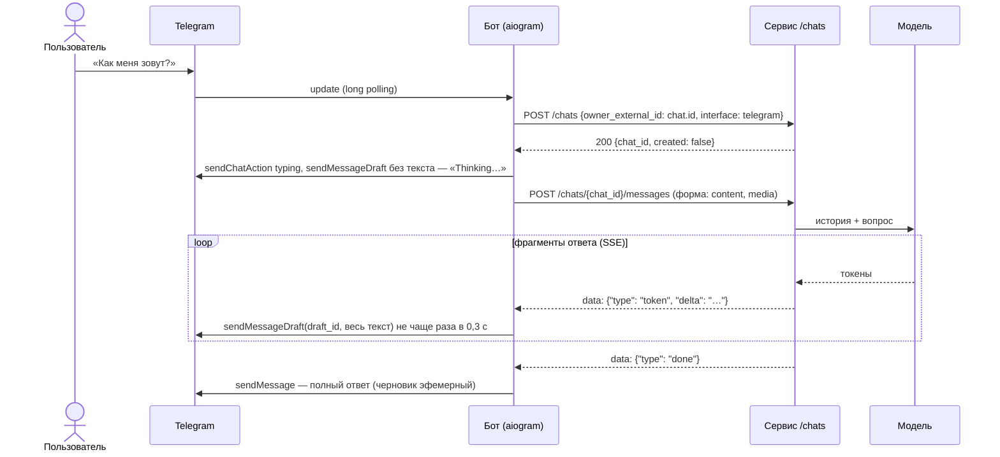
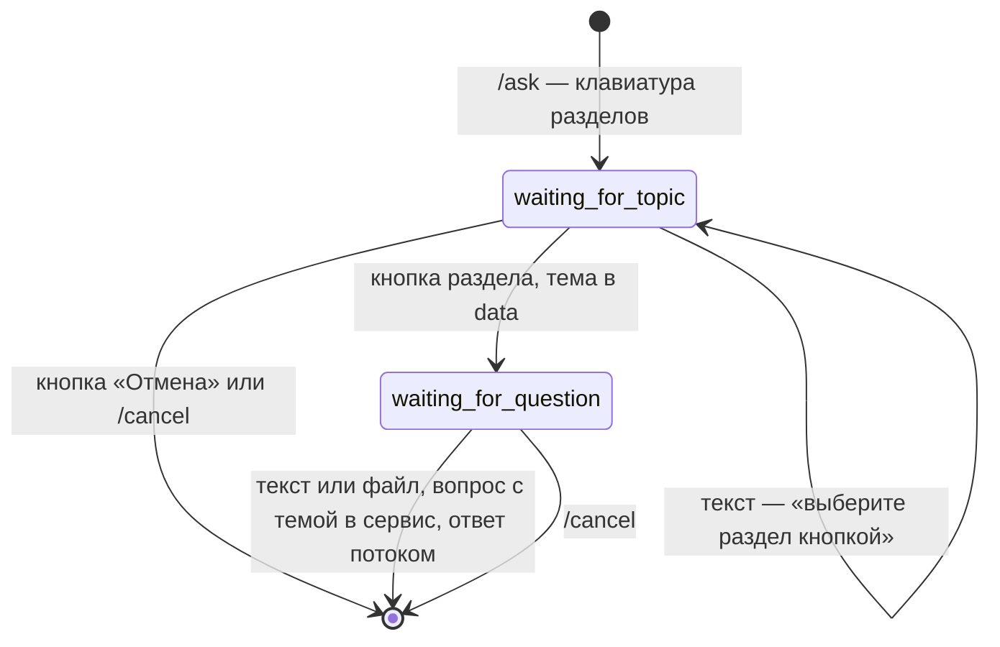

# Telegram-бот — тонкий клиент чата (блоки 4.2–4.3)

Бот на aiogram 3 в папке `bot/`. Вся работа с моделью — в chat-сервисе блока 4.1 ([`docs/chat.md`](chat.md)): бот не знает про LLM и не хранит историю. На каждое сообщение он:
1. находит чат клиента — `POST /chats`;
2. отправляет вопрос — `POST /chats/{id}/messages`: текст, а с блока 4.3 и фото, голосовое, PDF или DOCX — формой с файлом;
3. показывает ответ потоком — с блока 4.3 нативным черновиком `sendMessageDraft`.

С блока 4.3 у бота есть и обратный канал: сервис пишет пользователю первым через HTTP-API бота `POST /notify` (раздел «Уведомления из сервиса»).

| | Бот (`bot/`) | Сервис (`app/`) |
|---|---|---|
| Хранит | состояние сценария `/ask` в памяти процесса | историю чатов (JSONL или Postgres), вложения в `media_refs` |
| Решает | какую команду выполнить, как показать ответ в Telegram; скачивает файл из Telegram | контекст и бюджет токенов, системный промпт, проверка входа и ответа, вызов модели; разбирает файл: картинка, Whisper, PDF, DOCX |
| Падает | история цела, начатый сценарий `/ask` забыт | бот отвечает «сервис недоступен», без трассировки |

## Как устроено



| Файл | Что делает |
|---|---|
| `bot/__main__.py` | точка входа `python -m bot`: настройки, `Bot`, `Dispatcher(storage=MemoryStorage())`, роутеры, `dp["backend"]`, один `httpx.AsyncClient` на приложение (закрывается в `finally`), HTTP-API `/notify` рядом с polling, проверки, polling |
| `bot/config.py` | `BotSettings` (pydantic-settings): `BOT_TOKEN`, `BACKEND_URL`, `BOT_ADMIN_IDS` и необязательные настройки, с блока 4.3 — `INTERNAL_TOKEN`, `BOT_API_PORT`, `BOT_STREAMING`, `BACKEND_STREAM_TIMEOUT`, `BOT_DEFAULT_USER_NAME` |
| `bot/services/backend_client.py` | `BackendClient` на httpx: `get_or_create_chat`, `send_message(chat_id, content, media=None, mime=None)` — один метод для текста и файлов, поток SSE; `clear_messages`, `health`; таймауты и повтор при ошибке подключения |
| `bot/services/sse.py` | разбор Server-Sent Events: `event:`, многострочные `data:`, комментарии; концы строк — только `\r\n`, `\r`, `\n` |
| `bot/services/chat_queue.py` | `ChatQueue`: вопросы и `/clear` одного чата Telegram — по очереди |
| `bot/services/streaming.py` | показ ответа потоком: «печатает…», черновик `sendMessageDraft` (`DraftRenderer`) или правки (`StreamRenderer`), длинные ответы, ошибки |
| `bot/services/telegram.py` | `TelegramSession`: HTTPS до Telegram по хранилищу сертификатов ОС, прокси |
| `bot/handlers/` | `commands.py`, `fsm.py`, `media.py` (блок 4.3: фото, голос, аудио, документы), `text.py`, `errors.py`; `__init__.py` подключает их по порядку |
| `bot/web.py` | блок 4.3: HTTP-API бота на FastAPI — `POST /notify` с `X-Internal-Token`, `GET /health` |
| `bot/states.py`, `bot/keyboards/inline.py` | сценарий `AskFlow` и клавиатура разделов |
| `bot/texts.py` | все тексты бота и перевод ошибок в сообщения пользователю |

**Зависимости в handlers.** `BackendClient` лежит в `dp["backend"]`, настройки — в `dp["settings"]`, очередь вопросов — в `dp["chat_queue"]`. aiogram передаёт данные диспетчера в handlers и фильтры параметрами с теми же именами (`backend: BackendClient`, `settings: BotSettings`, `chat_queue: ChatQueue`), поэтому свой middleware не нужен. Один `BackendClient` (и один пул соединений httpx) работает на весь процесс и закрывается при остановке.

**Порядок роутеров** (`bot/handlers/__init__.py`) — aiogram отдаёт сообщение первому подходящему handler:
1. **`commands`**. Первый в нём — `/cancel`: он сбрасывает сценарий на любом шаге. Если бы handler сценария стоял раньше, «/cancel» в ожидании вопроса ушёл бы в сервис как текст. Остальные команды тоже работают посреди сценария и не сбрасывают его.
2. **`fsm`** — `/ask` и шаги сценария.
3. **`media`** (блок 4.3) — фото, голос, аудио, PDF и DOCX уходят в сервис файлом. В сценарии `/ask` на шаге вопроса файл — вопрос по теме, на шаге выбора раздела — подсказка выбрать раздел.
4. **`text`** — остальной текст уходит в сервис как вопрос. Неизвестная команда получает подсказку `/help`, стикеры и видео — подсказку, что бот понимает.
5. **`errors`** — последний рубеж. Исключение, которое handler не обработал сам, попадает в лог с трассировкой, а пользователь видит «что-то пошло не так».

## Один чат на клиента — идемпотентный `POST /chats`

`get_or_create_chat(owner_external_id, interface)`:
- `owner_external_id` — Telegram `chat.id` строкой, `interface` — `telegram`;
- в личном чате `chat.id` — это id пользователя, в группе — id группы, и история тогда общая на группу.

`POST /chats` с тем же `owner_external_id` и `interface` возвращает уже существующий чат с `"created": false`. Для этого сервис доработан в блоке 4.2:
- в обоих хранилищах — `get_or_create_chat`;
- одновременные запросы создают один чат;
- в Postgres — индекс `ix_chats_owner_interface`, миграция `e62e277f79f4`.

Подробности — в [`docs/chat.md`](chat.md#эндпоинты).

**Вопросы одного чата — по очереди.** aiogram обрабатывает апдейты параллельно. Без очереди второй вопрос, присланный во время ответа на первый, ушёл бы в сервис сразу и ждал бы в очереди сервиса без единого байта ответа. Это ожидание входит в таймаут бота: при ответе `llama3.2` дольше `BACKEND_STREAM_TIMEOUT` второй вопрос получил бы «ответ занимает слишком долго», а сервис всё равно ответил бы на него позже — в историю попал бы ответ, которого пользователь не видел. Поэтому `ChatQueue` держит замок на каждый Telegram chat.id: второй вопрос и `/clear` ждут в боте, пока показан текущий ответ. Разные чаты отвечают параллельно, а `/cancel`, `/help` и кнопки очередь не ждут.

**Лимит запросов — на чат.** Бот передаёт `X-User-ID: chat-<chat_id>`. Без этого заголовка лимит `RATE_LIMIT_PER_MIN` (блок 3.8) считал бы всех пользователей бота одним клиентом — по IP бота.

Бот не хранит соответствие «чат Telegram → chat_id» и спрашивает сервис на каждое сообщение. Это один короткий запрос (десятки миллисекунд против секунд ответа модели), зато после перезапуска бота ничего не теряется. Если хранилище сервиса сменили, бот не держит устаревший id: следующий `POST /chats` найдёт или создаст чат в новом хранилище.

## Ответ потоком

- **«Печатает…»**. Пока модель думает над первым словом (`llama3.2` на CPU — до 15 с, фото — дольше), в чате висит статус `typing`: `ChatActionSender` повторяет `sendChatAction` каждые 5 секунд.

**Черновик `sendMessageDraft`** (блок 4.3, `BOT_STREAMING=draft` — по умолчанию). Нативный стриминг Telegram: черновик ответа растёт у пользователя с анимацией, а не правками сообщения.
- **Сразу — пустой черновик.** По документации Bot API 10.0 Telegram показывает на его месте «Thinking…». aiogram пустые поля в запрос не кладёт, так что `text` в нём нет совсем. Если Telegram такой черновик не примет, бот обойдётся без «Thinking…»: на правки он переходит, только если отклонён черновик с текстом.
- **Один `draft_id` на весь ответ.** Обновления с тем же id Telegram анимирует. Каждое обновление показывает весь текст, пришедший к этому моменту.
- **Не чаще раза в 0,3 с** (`DRAFT_INTERVAL`), первый текст — сразу. Задание отправляет черновик на каждый фрагмент, но фрагмент приходит на каждое слово: это десятки запросов к Bot API в секунду и `429 Too Many Requests`. Если Telegram всё же попросил паузу, следующие фрагменты копятся в буфере, пока она не пройдёт.
- **Черновик живёт около 30 секунд.** Если модель надолго задумалась (фото на CPU), черновик обновляется тем же текстом раз в 20 с (`DRAFT_KEEPALIVE`).
- **В конце — `sendMessage` с полным текстом.** Черновик эфемерный: без этого ответ исчез бы. Ответ длиннее 4000 символов: готовая часть отправляется сообщением, остаток идёт новым черновиком с новым `draft_id`.
- **Черновик — только показ.** Ошибка Telegram на черновике (сеть, 5xx) пишется в лог и не роняет ответ: его всё равно сохранит финальный `sendMessage`. Поддержка жизни черновика — отдельная задача, она только обновляет черновик и соблюдает паузу после 429; на правки переключает лишь основной поток ответа.
- **Нужен aiogram 3.24+**: в нём появился `send_message_draft` (`requirements.txt`).
- **Только личные чаты.** `sendMessageDraft` принимает лишь `chat_id` личного чата. В группе, а также если Telegram отклонил черновик с текстом (старый Bot API), ответ показывают правки сообщения — как в блоке 4.2. Правки включаются для всех чатов и настройкой `BOT_STREAMING=edit`.

**Правки сообщения** (блок 4.2; в группах и с `BOT_STREAMING=edit`):
- **Первый фрагмент** приходит новым сообщением бота, дальше оно дописывается `message.edit_text(buffer)`. Буфер копит весь текст, и каждая правка показывает его целиком.
- **Правки — не чаще раза в секунду** (`EDIT_INTERVAL`). В задании сказано «после каждого SSE-чанка», но:
  - фрагменты от `llama3.2` приходят по слову;
  - Telegram ограничивает частоту правок одного сообщения и на частые правки отвечает `429 Too Many Requests: retry after N`.

  Поэтому фрагменты копятся в буфере, а очередная правка показывает всё пришедшее. После события `done` последняя правка выполняется всегда, и полный текст не теряется. Если Telegram всё же ответил «подождите N секунд», промежуточных правок нет, пока пауза не пройдёт. Финальная правка и новое сообщение ждут паузу и повторяются: их пропустить нельзя.
- **Длинный ответ.** У Telegram предел сообщения — 4096 символов. Ответ длиннее 4000 продолжается новым сообщением, разрыв — по последнему переводу строки или пробелу.
- **Ответ короче 40 символов приходит целиком, одним обновлением.** Сервис придерживает последние 40 символов ответа: это защитный слой блока 3.8 (`StreamGuard`), см. `docs/chat.md`.
- **Текст модели — как есть.** `parse_mode` не задан: `<`, `*`, `_` в ответе показываются символами, а не ломают разметку.
- **Ответ из одних пробелов** — сообщение «Ассистент не прислал ответа»: пустое сообщение Telegram не принимает.
- **Строки потока режет свой разбор.** Бот не использует `httpx` `aiter_lines()`: она делит текст ещё и по `\u2028`, `\x85` и подобным символам, которые модель может вставить в ответ, — кусок после них пропал бы. По спецификации SSE конец строки — только `\r\n`, `\r` или `\n`.

| Что случилось | Что видит пользователь |
|---|---|
| Сервис не запущен (`httpx.ConnectError`, `ConnectTimeout` — после трёх попыток) | «Сервис недоступен, попробуйте позже.» |
| Таймаут (`httpx.ReadTimeout`: `BACKEND_STREAM_TIMEOUT`, 120 с, — ожидание первого фрагмента и пауза между фрагментами) или 504 | «Ответ занимает слишком долго…» |
| 429 — лимит `RATE_LIMIT_PER_MIN` блока 3.8 | «Слишком много запросов, подождите минуту.» |
| 5xx без известного кода | «Внутренняя ошибка сервиса…» |
| 503 `chat_storage_unavailable` — хранилище истории недоступно | «История диалогов сейчас недоступна…» |
| 502 `llm_unavailable` — модель недоступна до начала ответа | «Модель сейчас недоступна…» |
| 422 — текст не прошёл валидацию | «Сообщение не принято…» |
| Файл не принят (`media_*`, `audio_*`, `vision_*`: велик, не тот тип, голос или фото не настроены) | текст ошибки сервиса как есть — он написан для пользователя |
| Событие `error` посреди ответа (обрыв у провайдера, таймаут модели) | уже показанный текст и пометка «⚠️ Ответ прерван: …» |
| Проверка входа блока 3.8 отклонила вопрос | готовый отказ сервиса — обычный ответ |

Если пользователь ушёл посреди ответа или бот упал, сервис сохраняет то, что успело прийти: поток `send_message` закрывается, и сервис видит обрыв соединения (блок 4.1). С блока 4.3 сервис замечает обрыв и до первого фрагмента — например, когда бот не дождался ответа по `BACKEND_STREAM_TIMEOUT`.

## Устойчивость HTTP-клиента (блок 4.3)

- **Один `httpx.AsyncClient` на всё приложение.** Его создаёт `make_http()` в `bot/__main__.py`, закрывает `await http.aclose()` в `finally` — и при Ctrl+C, и при ошибке старта. Пул соединений с сервисом общий.
- **Таймауты:** подключение 3 с, отправка запроса 10 с, ожидание соединения из пула 5 с, ответ на обычный запрос — `BACKEND_TIMEOUT` (60 с). У потока ответа модели свой предел чтения — `BACKEND_STREAM_TIMEOUT` (120 с, из задания): это пауза до первого фрагмента и между фрагментами, а не длина всего ответа. Для фото на CPU этого мало: `gemma3:4b` думает над скриншотом 3–4 минуты до первого слова. Тогда в `.env` — `BACKEND_STREAM_TIMEOUT=600` и `LLM__REQUEST_TIMEOUT=600` (у сервиса). Если бот всё же ушёл по таймауту, сервис это замечает и обрывает запрос к модели, так что `/clear` сразу после «Ответ занимает слишком долго…» не ждёт.
- **Повтор — только при ошибке подключения** (`httpx.ConnectError`, `ConnectTimeout`): запрос тогда точно не дошёл до сервиса, и повторить его безопасно, даже вопрос с файлом. Две повторные попытки с паузой 0,5 и 1 с. Ответы 4xx и 5xx не повторяются: 5xx мог случиться уже после вызова модели, а он стоит денег у платного провайдера. Поток, который уже начал отдавать ответ, не повторяется — пользователь получил бы ответ дважды.
- **Ошибки — текстом, не трассировкой** (таблица выше). Трассировка остаётся в логе бота.
- **Имя по умолчанию.** `BOT_DEFAULT_USER_NAME` (пусто — «Александра», «-» — без имени) `BackendClient` отправляет полем `user_name` с каждым вопросом. Пока пользователь не представился, модель обращается к нему по этому имени и не берёт имя со скриншотов и из документов ([`docs/chat.md`](chat.md#имя-по-умолчанию-блок-43)). Неверное значение (цифры, больше трёх слов, длиннее 40 знаков) — ошибка при старте бота. В логе старта — `default_user_name=on|off`, само имя в лог не пишется.

## Медиа (блок 4.3)

Бот файл не разбирает: скачивает его из Telegram и отправляет в сервис тем же `BackendClient.send_message(chat_id, content, media=bytes, mime=...)`, что и текст. Картинку, расшифровку голоса и текст документа готовит сервис (`app/chat/media.py`), поэтому `openai`, `pypdf` и `python-docx` боту не нужны — это проверяет тест.

| Что прислали | Что уходит в сервис |
|---|---|
| Фото | самый большой размер не больше 2 МБ, `image/jpeg` (фото из Telegram всегда JPEG) |
| Картинка файлом (без сжатия) | как фото, если не больше 2 МБ; больше — подсказка прислать сжатым фото |
| Голосовое | `.ogg` как есть, `audio/ogg`: Whisper принимает его без конвертации |
| Аудиофайл | mp3/m4a с MIME от Telegram |
| PDF, DOCX до 10 МБ | файл с исходным именем; `application/octet-stream` от Telegram — MIME по расширению |
| Другой документ, `.doc`, файл больше 10 МБ | подсказка, в сервис не уходит |
| Стикер, видео | подсказка, что бот понимает |

- **Подпись к файлу — вопрос.** Без подписи уходит вопрос по умолчанию: «Посмотри на изображение и помоги разобраться…», «Ответь на голосовое сообщение.», «Кратко перескажи документ…» — сервису нужен текст вопроса.
- **Скачивание** — `bot.get_file()` и `bot.download_file(destination=BytesIO())`: Bot API отдаёт файлы до 20 МБ. Файл живёт только в памяти бота, на диск не пишется. Не скачался — «Не получилось скачать файл…».
- **В логе бота** — тип и размер файла, ни подписи, ни содержимого.
- **Фото и `llama3.2`.** Текстовая модель картинок не видит: фото смотрит vision-модель сервиса (`CHAT_VISION_MODEL`). Если её нет, сервис отвечает понятным текстом, и бот его показывает. Голосовые — так же с `AUDIO_API_KEY` (Whisper).

## Уведомления из сервиса — `POST /notify` (блок 4.3)

Обратный канал backend → bot: сервис пишет пользователю первым — статус заявки изменился, фоновая задача закончилась, истекает подписка. Бот поднимает HTTP-API (`bot/web.py`, FastAPI) рядом с polling, в том же цикле событий: `uvicorn.Server` и `dp.start_polling` работают одновременно.

```text
POST http://127.0.0.1:9000/notify
X-Internal-Token: <INTERNAL_TOKEN>
{"chat_id": 123456789, "text": "Заявка №42 решена: доступ восстановлен."}
```

- **`INTERNAL_TOKEN`** — общий секрет сервиса и бота, только в `.env`, не короче 16 символов. Не задан — API не запускается, бот работает как в блоке 4.2. Сгенерировать: `python -c "import secrets; print(secrets.token_urlsafe(32))"`.
- **401** — нет заголовка `X-Internal-Token` или он не совпал (сравнение `hmac.compare_digest`). Токен проверяется раньше тела: без токена — 401 на любое тело, даже не JSON, и о формате запроса посторонний ничего не узнаёт.
- **422** — нет `chat_id`, текст пустой или из одних пробелов, длиннее 4096 знаков UTF-16 (так считает Telegram: эмодзи — два знака).
- **Ответы Telegram — кодами:** 403 — пользователь заблокировал бота, 404 — такого чата нет (пользователь ни разу не писал боту), 400 — Telegram отклонил сообщение по другой причине, 429 — Telegram просит подождать, 502 — Telegram недоступен. Текст уведомления в лог не пишется.
- **Слушает `BOT_API_HOST:BOT_API_PORT`** — по умолчанию `127.0.0.1:9000`: только этот компьютер, снаружи `/notify` недоступен, даже если токен утёк. В Docker — `0.0.0.0`, чтобы сервис из другого контейнера достучался. Порт занят (например, запущен второй бот) — ошибка `notify_api_failed` в логе, а бот отвечает как обычно.
- **Ctrl+C** останавливает и polling, и API: сигналы ловит `asyncio.run`, а не uvicorn (`ApiServer`), и в `finally` API останавливается штатно.

На стороне сервиса — `app/services/notifier.py` (`notify_user`, `BOT_URL` + тот же `INTERNAL_TOKEN`) и демо-эндпоинт `POST /chats/{chat_id}/system-message` (`docs/chat.md`).

Проверка на Windows (бот запущен с `INTERNAL_TOKEN` в `.env`; `chat_id` — ваш Telegram id, его видно в логе бота `telegram_chat=…`):

```powershell
$token = "<INTERNAL_TOKEN из .env>"
$body = [Text.Encoding]::UTF8.GetBytes((@{chat_id = 123456789; text = "Заявка №42 решена."} | ConvertTo-Json))
Invoke-RestMethod -Method Post http://127.0.0.1:9000/notify -Headers @{"X-Internal-Token" = $token} -ContentType "application/json; charset=utf-8" -Body $body
# 401 без токена:
curl.exe -s -o NUL -w "%{http_code}\n" -X POST http://127.0.0.1:9000/notify -H "Content-Type: application/json" -d "{}"
```

## Сценарий `/ask`



- **Разделы** взяты из руководства пользователя «Личного кабинета» (`data/knowledge_base.json`), по которому отвечает ассистент дипломного проекта: «Вход и пароль», «Уведомления и письма», «Оплата и документы», «API и ключи», «Мобильное приложение». Кнопки собирает `InlineKeyboardBuilder`, `callback_data` — `topic:<slug>`, отмена — `topic:cancel`.
- **Вопрос** уходит в сервис обычным сообщением чата: `«Тема: Оплата и документы. Вопрос: …»`. Он остаётся в истории, и следующие вопросы учитывают тему.
- **Устаревшая кнопка.** Кнопки старых меню убирают выбор раздела, «Отмена», `/cancel` и новый `/ask`. Если кнопка всё же осталась (например, бот перезапустился), нажатие даёт «выбор неактуален», а состояние не меняется. Кнопки в этом случае бот не трогает: в группе это может быть действующее меню другого участника, ведь состояние сценария у каждого своё.
- **Хранение состояния.** Оно лежит в `MemoryStorage` и после перезапуска бота теряется. Это допустимо: сценарий короткий, а история разговора лежит в сервисе. Для нескольких копий бота нужен `RedisStorage` — Redis в проекте уже есть.
- **Шаг подтверждения** `confirming` по заданию необязателен и не реализован: лишний щелчок перед вопросом в поддержку только мешает.

## Команды

| Команда | Что делает |
|---|---|
| `/start` | находит или создаёт чат в сервисе (`POST /chats`), приветствие и подсказка |
| `/help` | список команд |
| `/ask` | вопрос по разделу: кнопка, затем текст |
| `/clear` | `DELETE /chats/{id}/messages` — следующее сообщение начинает разговор с чистого листа |
| `/cancel` | сбрасывает сценарий `/ask` на любом шаге |
| `/status` | только для `BOT_ADMIN_IDS`: отвечает ли сервис (`GET /health`) и за сколько; в меню команд не показывается |

## Запуск

1. **Создать бота у [@BotFather](https://t.me/BotFather)** (`/newbot`) и записать токен строкой `BOT_TOKEN=...` в `.env` в корне проекта. `.env` — в `.gitignore`, в репозиторий токен не попадает. Проверка: `git log -p -- .env` ничего не выводит.
2. **Обновить базу**, если используется Postgres: `alembic upgrade head` — индекс блока 4.2.
3. **Запустить сервис, затем бота** — в двух терминалах:

```powershell
pip install -r requirements.txt                 # aiogram, aiohttp-socks; для сервиса — pypdf, python-docx
uvicorn app.main:app --port 8000                # терминал 1: chat-сервис
python -m bot                                   # терминал 2: бот
```

При старте бот:
- проверяет токен и связь с Telegram (`getMe`). Если не вышло, бот не стартует и пишет причину;
- проверяет сервис (`GET /health`). Если сервис недоступен, это только предупреждение в логе: сервис можно поднять и после бота;
- записывает меню команд (`setMyCommands`);
- если задан `INTERNAL_TOKEN`, поднимает HTTP-API: в логе `notify_api_started url=http://127.0.0.1:9000/notify`;
- начинает long polling: `bot_started … streaming=draft default_user_name=on`.

Остановка — Ctrl+C.

**Сеть до Telegram.**
- **`BOT_USE_SYSTEM_CERTS=true`** (по умолчанию) — HTTPS до `api.telegram.org` проверяется по хранилищу сертификатов ОС через truststore. Без этого aiogram проверяет сертификат по certifi, и в сети, которая подменяет HTTPS-сертификаты, бот падает с `CERTIFICATE_VERIFY_FAILED` — как было с tiktoken и spaCy. Проверка не отключается никогда.
- **Если до Telegram нет связи** (на Windows — `[Превышен таймаут семафора]`), сеть не пускает к `api.telegram.org` напрямую. Бот так и пишет и подсказывает прокси. Учебный прокси из `LLM__PROXY_URL` (`http://логин:пароль@хост:порт`) подходит, если он пропускает к Telegram: та же строка — в `BOT_PROXY_URL`.
- **`BOT_PROXY_URL`** — прокси (`http://`, `socks4://` или `socks5://`, с портом), если Telegram напрямую недоступен. Неверный адрес отклоняется при старте, и сам адрес в текст ошибки не попадает: в нём бывает пароль. Если прокси не пропустил, бот пишет причину одной строкой.

**Логи.** В лог бота не попадают ни вопросы, ни ответы, ни файлы, только id чатов, тип и размер файла, способ показа (`mode=draft|edit`), число сообщений и обновлений, длина ответа. Персональные данные маскирует и хранит сервис (блоки 3.6–3.8). Токен в лог не попадает: в настройках он `SecretStr`.

## Тесты

```powershell
python -m pytest tests/bot -v
```

- **`test_backend_client.py`** — `BackendClient` через `httpx.MockTransport`:
  - разбор SSE в формате блока 4.3 (`data: {"type":"token","delta":...}` … `{"type":"done"}`), `\u2028` внутри ответа, `\r\n` на границе кусков, неизвестные события;
  - вопрос формой, с файлом — `multipart/form-data`, имя файла по-русски; заголовок `X-User-ID`;
  - событие `error` и поток без `done`;
  - повтор при `ConnectError`/`ConnectTimeout` (и с файлом), без повтора на 4xx/5xx, `ReadTimeout` и начавшийся поток;
  - таймауты клиента и потока, `trust_env=False`;
  - тело ошибки сохраняется, перевод ошибок в тексты задания, текст ошибки вложения — от сервиса.
- **`test_bot_media.py`** (блок 4.3) — фото (размер до 2 МБ), голос как ogg, аудио, PDF и DOCX, картинка файлом, отказы по типу и размеру, файл в сценарии `/ask`, ошибка скачивания, текст ошибки сервиса; бот не импортирует `openai`, `pypdf`, `docx`.
- **`test_notify.py`** (блок 4.3) — `/notify`: 200 и сообщение в Telegram, 401 без токена и с чужим (и раньше 422), проверка тела, ответы Telegram 403/404/429/502; API поднимается на свободном порту рядом с polling и останавливается штатно, занятый порт не роняет бота; общий `httpx.AsyncClient` закрывается в `finally`.
- **`test_fsm.py`** — сценарий `/ask` через настоящий `Dispatcher`: апдейты подаются в `dp.feed_update`, Bot API подменён сессией без HTTP (`MockedSession` в `bot_fakes.py`). Проверяются:
  - тема в `data`, промпт `«Тема: … Вопрос: …»` в сервисе;
  - `/cancel` на каждом шаге, кнопка «Отмена», устаревшая кнопка, текст вместо кнопки;
  - в группе чужое нажатие не ломает меню автора, повторный `/ask` убирает старое меню;
  - разделы — из домена диплома.
- **`test_bot_commands.py`**:
  - `/start` создаёт чат, и на все сообщения чат один;
  - вопросы одного чата идут по очереди, разных чатов — параллельно;
  - `/clear`, `/help`, `/status` для администратора и для остальных;
  - сервис недоступен — сообщение, а не трассировка;
  - ошибка до первого фрагмента и посреди ответа;
  - черновик в личном чате, правки в группе и с `BOT_STREAMING=edit`;
  - неизвестная команда и стикер.
- **`test_bot_streaming.py`** — показ потоком:
  - черновик: «Thinking…», один `draft_id`, обновления не чаще интервала, финальный `sendMessage`, длинный ответ, переход на правки, если Telegram отклонил черновик, 429, поддержка жизни черновика;
  - правки не чаще интервала, но финальный текст полный;
  - длинный ответ в нескольких сообщениях;
  - «message is not modified» и «Too Many Requests» от Telegram: пауза соблюдается, новое сообщение повторяется;
  - ответ из одних пробелов.
- **`test_bot_config.py`**:
  - `.env`, `BOT_ADMIN_IDS` в разных форматах;
  - нет токена или он неверного вида — понятная ошибка;
  - неверный `BOT_PROXY_URL` отклоняется, пароль в текст ошибки не попадает;
  - HTTPS по хранилищу ОС, в том числе через прокси.

Идемпотентный `POST /chats` проверяют тесты сервиса в `tests/chat/`:
- контракт для JSON и Postgres;
- одновременные запросы — один чат.
