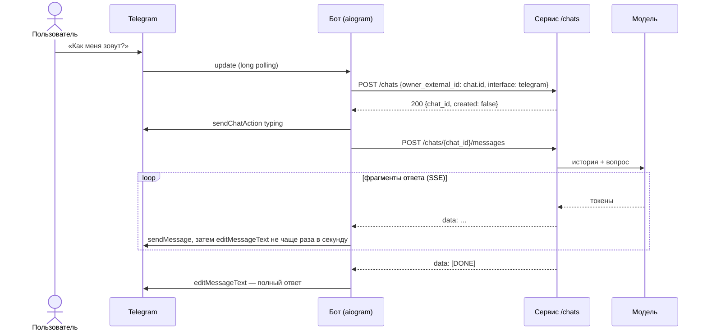
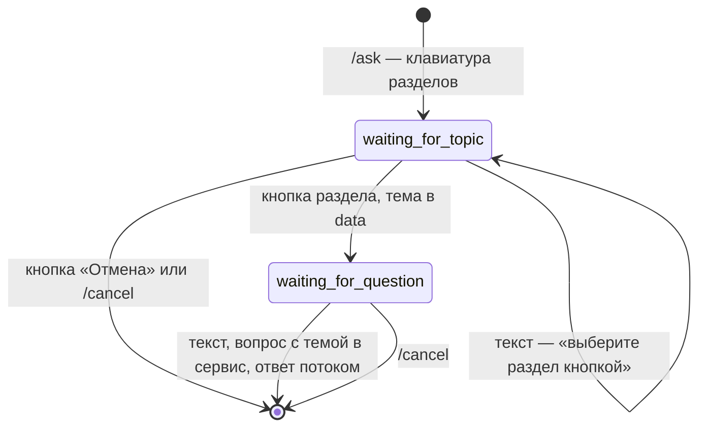

# Telegram-бот — тонкий клиент чата (блок 4.2)

Бот на aiogram 3 в папке `bot/`. Вся работа с моделью — в chat-сервисе блока 4.1 ([`docs/chat.md`](chat.md)): бот не знает про LLM и не хранит историю. На каждое сообщение он:
1. находит чат клиента — `POST /chats`;
2. отправляет текст — `POST /chats/{id}/messages`;
3. показывает ответ потоком.

| | Бот (`bot/`) | Сервис (`app/`) |
|---|---|---|
| Хранит | состояние сценария `/ask` в памяти процесса | историю чатов (JSONL или Postgres) |
| Решает | какую команду выполнить, как показать ответ в Telegram | контекст и бюджет токенов, системный промпт, проверка входа и ответа, вызов модели |
| Падает | история цела, начатый сценарий `/ask` забыт | бот отвечает «сервис недоступен», без трассировки |

## Как устроено



| Файл | Что делает |
|---|---|
| `bot/__main__.py` | точка входа `python -m bot`: настройки, `Bot`, `Dispatcher(storage=MemoryStorage())`, роутеры, `dp["backend"]`, проверки, polling |
| `bot/config.py` | `BotSettings` (pydantic-settings): `BOT_TOKEN`, `BACKEND_URL`, `BOT_ADMIN_IDS` и необязательные настройки |
| `bot/services/backend_client.py` | `BackendClient` на httpx: `get_or_create_chat`, `send_message` (поток SSE), `clear_messages`, `health` |
| `bot/services/sse.py` | разбор Server-Sent Events: `event:`, многострочные `data:`, комментарии; концы строк — только `\r\n`, `\r`, `\n` |
| `bot/services/chat_queue.py` | `ChatQueue`: вопросы и `/clear` одного чата Telegram — по очереди |
| `bot/services/streaming.py` | показ ответа потоком: «печатает…», правки с интервалом, длинные ответы, ошибки |
| `bot/services/telegram.py` | `TelegramSession`: HTTPS до Telegram по хранилищу сертификатов ОС, прокси |
| `bot/handlers/` | `commands.py`, `fsm.py`, `text.py`, `errors.py`; `__init__.py` подключает их по порядку |
| `bot/states.py`, `bot/keyboards/inline.py` | сценарий `AskFlow` и клавиатура разделов |
| `bot/texts.py` | все тексты бота и перевод ошибок в сообщения пользователю |

**Зависимости в handlers.** `BackendClient` лежит в `dp["backend"]`, настройки — в `dp["settings"]`, очередь вопросов — в `dp["chat_queue"]`. aiogram передаёт данные диспетчера в handlers и фильтры параметрами с теми же именами (`backend: BackendClient`, `settings: BotSettings`, `chat_queue: ChatQueue`), поэтому свой middleware не нужен. Один `BackendClient` (и один пул соединений httpx) работает на весь процесс и закрывается при остановке.

**Порядок роутеров** (`bot/handlers/__init__.py`) — aiogram отдаёт сообщение первому подходящему handler:
1. **`commands`**. Первый в нём — `/cancel`: он сбрасывает сценарий на любом шаге. Если бы handler сценария стоял раньше, «/cancel» в ожидании вопроса ушёл бы в сервис как текст. Остальные команды тоже работают посреди сценария и не сбрасывают его.
2. **`fsm`** — `/ask` и шаги сценария.
3. **`text`** — остальной текст уходит в сервис как вопрос. Неизвестная команда получает подсказку `/help`, фото и голос — «пока только текст» (медиа — блок 4.3).
4. **`errors`** — последний рубеж. Исключение, которое handler не обработал сам, попадает в лог с трассировкой, а пользователь видит «что-то пошло не так».

## Один чат на клиента — идемпотентный `POST /chats`

`get_or_create_chat(owner_external_id, interface)`:
- `owner_external_id` — Telegram `chat.id` строкой, `interface` — `telegram`;
- в личном чате `chat.id` — это id пользователя, в группе — id группы, и история тогда общая на группу.

`POST /chats` с тем же `owner_external_id` и `interface` возвращает уже существующий чат с `"created": false`. Для этого сервис доработан в блоке 4.2:
- в обоих хранилищах — `get_or_create_chat`;
- одновременные запросы создают один чат;
- в Postgres — индекс `ix_chats_owner_interface`, миграция `e62e277f79f4`.

Подробности — в [`docs/chat.md`](chat.md#эндпоинты).

**Вопросы одного чата — по очереди.** aiogram обрабатывает апдейты параллельно. Без очереди второй вопрос, присланный во время ответа на первый, ушёл бы в сервис сразу и ждал бы в очереди сервиса без единого байта ответа. Это ожидание входит в таймаут бота: при ответе `llama3.2` дольше 30 секунд второй вопрос получил бы «отвечает слишком долго», а сервис всё равно ответил бы на него позже — в историю попал бы ответ, которого пользователь не видел. Поэтому `ChatQueue` держит замок на каждый Telegram chat.id: второй вопрос и `/clear` ждут в боте, пока показан текущий ответ. Разные чаты отвечают параллельно, а `/cancel`, `/help` и кнопки очередь не ждут.

**Лимит запросов — на чат.** Бот передаёт `X-User-ID: chat-<chat_id>`. Без этого заголовка лимит `RATE_LIMIT_PER_MIN` (блок 3.8) считал бы всех пользователей бота одним клиентом — по IP бота.

Бот не хранит соответствие «чат Telegram → chat_id» и спрашивает сервис на каждое сообщение. Это один короткий запрос (десятки миллисекунд против секунд ответа модели), зато после перезапуска бота ничего не теряется. Если хранилище сервиса сменили, бот не держит устаревший id: следующий `POST /chats` найдёт или создаст чат в новом хранилище.

## Ответ потоком

- **«Печатает…»**. Пока модель думает над первым словом (`llama3.2` на CPU — до 15 с), в чате висит статус `typing`: `ChatActionSender` повторяет `sendChatAction` каждые 5 секунд.
- **Первый фрагмент** приходит новым сообщением бота, дальше оно дописывается `message.edit_text(buffer)`. Буфер копит весь текст, и каждая правка показывает его целиком.
- **Правки — не чаще раза в секунду** (`EDIT_INTERVAL`). В задании сказано «после каждого SSE-чанка», но:
  - фрагменты от `llama3.2` приходят по слову;
  - Telegram ограничивает частоту правок одного сообщения и на частые правки отвечает `429 Too Many Requests: retry after N`.

  Поэтому фрагменты копятся в буфере, а очередная правка показывает всё пришедшее. После `[DONE]` последняя правка выполняется всегда, и полный текст не теряется. Если Telegram всё же ответил «подождите N секунд», промежуточных правок нет, пока пауза не пройдёт. Финальная правка и новое сообщение ждут паузу и повторяются: их пропустить нельзя.
- **Длинный ответ.** У Telegram предел сообщения — 4096 символов. Ответ длиннее 4000 продолжается новым сообщением, разрыв — по последнему переводу строки или пробелу.
- **Ответ короче 40 символов приходит одним сообщением, без правок.** Сервис придерживает последние 40 символов ответа: это защитный слой блока 3.8 (`StreamGuard`), см. `docs/chat.md`.
- **Текст модели — как есть.** `parse_mode` не задан: `<`, `*`, `_` в ответе показываются символами, а не ломают разметку.
- **Ответ из одних пробелов** — сообщение «Ассистент не прислал ответа»: пустое сообщение Telegram не принимает.
- **Строки потока режет свой разбор.** Бот не использует `httpx` `aiter_lines()`: она делит текст ещё и по `\u2028`, `\x85` и подобным символам, которые модель может вставить в ответ, — кусок после них пропал бы. По спецификации SSE конец строки — только `\r\n`, `\r` или `\n`.

| Что случилось | Что видит пользователь |
|---|---|
| Сервис не запущен (`httpx.ConnectError`) | «Сервис ответов сейчас недоступен…» |
| Таймаут (`httpx.ReadTimeout`, `BACKEND_TIMEOUT`, по умолчанию 30 с: ожидание первого фрагмента и пауза между фрагментами) или 504 | «Ассистент отвечает слишком долго…» |
| 429 — лимит `RATE_LIMIT_PER_MIN` блока 3.8 | «Слишком много сообщений подряд…» |
| 422 — текст не прошёл валидацию | «Сообщение не принято…» |
| 503 — хранилище истории недоступно | «История диалогов сейчас недоступна…» |
| 502 — модель недоступна до начала ответа | «Модель сейчас недоступна…» |
| Событие `error` посреди ответа (обрыв у провайдера, таймаут модели) | уже показанный текст и пометка «⚠️ Ответ прерван: …» |
| Проверка входа блока 3.8 отклонила вопрос | готовый отказ сервиса — обычный ответ |

Если пользователь ушёл посреди ответа или бот упал, сервис сохраняет то, что успело прийти: поток `send_message` закрывается, и сервис видит обрыв соединения (блок 4.1).

## Сценарий `/ask`



- **Разделы** взяты из руководства пользователя «Личного кабинета» (`data/knowledge_base.json`), по которому отвечает ассистент дипломного проекта: «Вход и пароль», «Уведомления и письма», «Оплата и документы», «API и ключи», «Мобильное приложение». Кнопки собирает `InlineKeyboardBuilder`, `callback_data` — `topic:<slug>`, отмена — `topic:cancel`.
- **Вопрос** уходит в сервис обычным сообщением чата: `«Тема: Оплата и документы. Вопрос: …»`. Он остаётся в истории, и следующие вопросы учитывают тему.
- **Устаревшая кнопка.** Кнопки старых меню убирают выбор раздела, «Отмена», `/cancel` и новый `/ask`. Если кнопка всё же осталась (например, бот перезапустился), нажатие даёт «выбор неактуален», а состояние не меняется. Кнопки в этом случае бот не трогает: в группе это может быть действующее меню другого участника, ведь состояние сценария у каждого своё.
- **Хранение состояния.** Оно лежит в `MemoryStorage` и после перезапуска бота теряется. Это допустимо: сценарий короткий, а история разговора лежит в сервисе. Для нескольких копий бота нужен `RedisStorage` — Redis в проекте уже есть.
- **Шаг подтверждения** `confirming` по заданию необязателен и не реализован: лишний щелчок перед вопросом в поддержку только мешает.

## Команды

| Команда | Что делает |
|---|---|
| `/start` | находит или создаёт чат в сервисе (`POST /chats`), приветствие и подсказка |
| `/help` | список команд |
| `/ask` | вопрос по разделу: кнопка, затем текст |
| `/clear` | `DELETE /chats/{id}/messages` — следующее сообщение начинает разговор с чистого листа |
| `/cancel` | сбрасывает сценарий `/ask` на любом шаге |
| `/status` | только для `BOT_ADMIN_IDS`: отвечает ли сервис (`GET /health`) и за сколько; в меню команд не показывается |

## Запуск

1. **Создать бота у [@BotFather](https://t.me/BotFather)** (`/newbot`) и записать токен строкой `BOT_TOKEN=...` в `.env` в корне проекта. `.env` — в `.gitignore`, в репозиторий токен не попадает. Проверка: `git log -p -- .env` ничего не выводит.
2. **Обновить базу**, если используется Postgres: `alembic upgrade head` — индекс блока 4.2.
3. **Запустить сервис, затем бота** — в двух терминалах:

```powershell
pip install -r requirements.txt                 # aiogram, aiohttp-socks
uvicorn app.main:app --port 8000                # терминал 1: chat-сервис блока 4.1
python -m bot                                   # терминал 2: бот
```

При старте бот:
- проверяет токен и связь с Telegram (`getMe`). Если не вышло, бот не стартует и пишет причину;
- проверяет сервис (`GET /health`). Если сервис недоступен, это только предупреждение в логе: сервис можно поднять и после бота;
- записывает меню команд (`setMyCommands`) и начинает long polling.

Остановка — Ctrl+C.

**Сеть до Telegram.**
- **`BOT_USE_SYSTEM_CERTS=true`** (по умолчанию) — HTTPS до `api.telegram.org` проверяется по хранилищу сертификатов ОС через truststore. Без этого aiogram проверяет сертификат по certifi, и в сети, которая подменяет HTTPS-сертификаты, бот падает с `CERTIFICATE_VERIFY_FAILED` — как было с tiktoken и spaCy. Проверка не отключается никогда.
- **Если до Telegram нет связи** (на Windows — `[Превышен таймаут семафора]`), сеть не пускает к `api.telegram.org` напрямую. Бот так и пишет и подсказывает прокси. Учебный прокси из `LLM__PROXY_URL` (`http://логин:пароль@хост:порт`) подходит, если он пропускает к Telegram: та же строка — в `BOT_PROXY_URL`.
- **`BOT_PROXY_URL`** — прокси (`http://`, `socks4://` или `socks5://`, с портом), если Telegram напрямую недоступен. Неверный адрес отклоняется при старте, и сам адрес в текст ошибки не попадает: в нём бывает пароль. Если прокси не пропустил, бот пишет причину одной строкой.

**Логи.** В лог бота не попадают ни вопросы, ни ответы, только id чатов, число сообщений и правок, длина ответа. Персональные данные маскирует и хранит сервис (блоки 3.6–3.8). Токен в лог не попадает: в настройках он `SecretStr`.

## Тесты

```powershell
python -m pytest tests/bot -v
```

- **`test_backend_client.py`** — `BackendClient` через `httpx.MockTransport`:
  - разбор SSE (несколько фрагментов, многострочный `data:`, комментарии, `[DONE]`, `\u2028` внутри ответа, `\r\n` на границе кусков);
  - заголовок `X-User-ID`;
  - событие `error` и поток без `[DONE]`;
  - тело ошибки 429 сохраняется;
  - `DELETE` уходит на нужный адрес, `get_or_create_chat` возвращает `UUID`;
  - перевод ошибок в тексты.
- **`test_fsm.py`** — сценарий `/ask` через настоящий `Dispatcher`: апдейты подаются в `dp.feed_update`, Bot API подменён сессией без HTTP (`MockedSession` в `bot_fakes.py`). Проверяются:
  - тема в `data`, промпт `«Тема: … Вопрос: …»` в сервисе;
  - `/cancel` на каждом шаге, кнопка «Отмена», устаревшая кнопка, текст вместо кнопки;
  - в группе чужое нажатие не ломает меню автора, повторный `/ask` убирает старое меню;
  - разделы — из домена диплома.
- **`test_bot_commands.py`**:
  - `/start` создаёт чат, и на все сообщения чат один;
  - вопросы одного чата идут по очереди, разных чатов — параллельно;
  - `/clear`, `/help`, `/status` для администратора и для остальных;
  - сервис недоступен — сообщение, а не трассировка;
  - ошибка до первого фрагмента и посреди ответа;
  - неизвестная команда и фото.
- **`test_bot_streaming.py`** — показ потоком:
  - правки не чаще интервала, но финальный текст полный;
  - длинный ответ в нескольких сообщениях;
  - «message is not modified» и «Too Many Requests» от Telegram: пауза соблюдается, новое сообщение повторяется;
  - ответ из одних пробелов.
- **`test_bot_config.py`**:
  - `.env`, `BOT_ADMIN_IDS` в разных форматах;
  - нет токена или он неверного вида — понятная ошибка;
  - неверный `BOT_PROXY_URL` отклоняется, пароль в текст ошибки не попадает;
  - HTTPS по хранилищу ОС, в том числе через прокси.

Идемпотентный `POST /chats` проверяют тесты сервиса в `tests/chat/`:
- контракт для JSON и Postgres;
- одновременные запросы — один чат.
