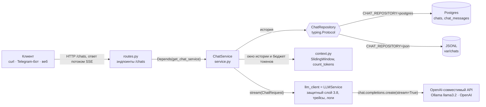
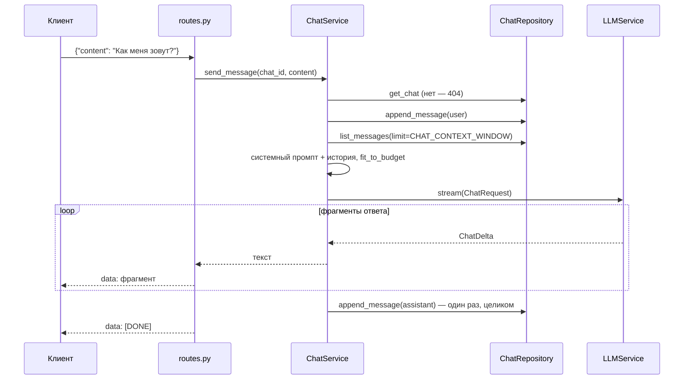

# Чат с историей на сервере (блок 4.1)

Модуль `app/chat/` превращает сервис из блоков 3.4–3.8 в stateful-чат: история диалога хранится на сервере, а не у клиента. Клиент присылает только новый вопрос, а сервис сам собирает контекст из истории.

Контракт `/chats/{chat_id}/messages` стабилен на весь курс. Поверх него работают:
- Telegram-бот как тонкий клиент — M4Б2;
- RAG — M5;
- инструменты агентов — M6.

## Архитектура



Один вопрос — `POST /chats/{chat_id}/messages`:



| Файл | Что в нём |
|---|---|
| `domain.py` | `Chat`, `ChatMessage` (Pydantic v2, только стандартная библиотека), ошибки `ChatNotFoundError` (404) и `ChatStorageError` (503) |
| `repository.py` | контракт `ChatRepository` через `typing.Protocol`: пять методов и поведение, общее для реализаций |
| `repositories/json_repo.py` | `JsonChatRepository`: файлы JSONL, запись только дописыванием |
| `repositories/pg_repo.py`, `pg_models.py` | `PostgresChatRepository` на async SQLAlchemy 2.x (asyncpg); ORM-модели `ChatRow`, `ChatMessageRow` наружу не выходят |
| `context.py` | скользящее окно, `count_tokens` (tiktoken, `o200k_base`), `fit_to_budget` |
| `service.py` | `ChatService`: история, контекст, поток ответа, сохранение ответа при обрыве |
| `routes.py` | эндпоинты `/chats` и формат SSE |
| `deps.py` | выбор хранилища по `CHAT_REPOSITORY`, сборка `ChatService`, движок Postgres в lifespan |
| `migrations/`, `alembic.ini` | миграция Alembic `chat tables` |

**Клиент модели — `LLMService`.** В задании это «адаптер вокруг AsyncOpenAI из M3Б4», и такой адаптер в проекте уже есть с блока 3.4. Его `stream()` вызывает `chat.completions.create(..., stream=True)` и уже умеет всё, что нужно ответу модели:
- защитный слой блока 3.8: проверка входа и всей истории, канарейка, `StreamGuard`, маскирование персональных данных в ответе;
- семафор запросов к модели;
- перевод ошибок SDK в коды 429, 502 и 504;
- span в Phoenix с `session.id` = id чата — диалог виден на вкладке Sessions;
- строка `llm_request_completed` в логе.

`ChatService` занят только своим: история, контекст и бюджет токенов. Ещё две вещи он делает сам:
- **Маскирует персональные данные до модели.** Email, телефон, карта уходят модели метками `[EMAIL]`, `[PHONE_RU]`, `[CARD]` (`mask_message`, блок 3.7). `LLMService` маскирует вход только в режиме ассистента `/chat`, а у чата всегда есть свой системный промпт. В истории сообщения хранятся как их написал пользователь.
- **Ставит вопросы одного чата в очередь** (`ChatLocks`). Второй вопрос, присланный, пока модель отвечает на первый, ждёт его ответа. Иначе история перемешалась бы — `[user, user, assistant, assistant]`, — а второй запрос ушёл бы модели без первого ответа. Для Telegram-бота это обычная ситуация: пользователь шлёт два сообщения подряд. Замки живут в памяти процесса, поэтому несколько копий сервиса общую очередь не делят.

## Стратегия контекста — скользящее окно

Модели уходят системный промпт и последние `CHAT_CONTEXT_WINDOW` сообщений чата (по умолчанию 10, то есть пять пар «вопрос — ответ»). Вторая стратегия задания, hybrid (сводка старой истории + последние M), не реализована. С `CHAT_CONTEXT_STRATEGY=hybrid` сервис не стартует и пишет понятную ошибку — он не работает молча со скользящим окном.

**Почему скользящее окно — для темы диплома.** Ассистент техподдержки «Личного кабинета» отвечает по руководству пользователя:
- **Диалоги короткие.** Вход, пароль, оплата, уведомления — 2–5 обменов репликами. Всё, что важно для ответа (имя, номер заявки, текст ошибки, что уже пробовали), звучит в последних сообщениях. Десять сообщений покрывают типичное обращение целиком.
- **Hybrid стоит лишнего вызова модели.** Для сжатия старой истории нужен ещё один вызов на каждое сообщение, как только диалог длиннее окна. На CPU `llama3.2` отвечает 10–30 секунд, и задержка удвоилась бы.
- **Сводка может исказить факты.** Модель может выдумать или потерять в сводке номер заявки, а ошибка тихо переходит во все следующие ответы. Окно передаёт сообщения дословно.
- **Окно предсказуемо и проверяемо.** Что увидит модель, однозначно следует из истории — это проверяют тесты `test_window_limits_history` и `test_budget_trims_old_messages`.

Цена — забывание: факт старше десяти сообщений модель уже не видит, и пользователю придётся его повторить. Для поддержки это приемлемо. Hybrid понадобится там, где диалог — длинная работа с документами. В проекте это M5 (RAG): там память о ранее обсуждённых статьях важнее.

**Системный промпт.** Это промпт чата, если его задали при создании, иначе `CHAT_SYSTEM_PROMPT` с названием продукта. Без системного сообщения `LLMService` подставил бы промпт ассистента `/chat` из блока 3.7. Тот отвечает только на вопросы о продукте, и проверка «Как меня зовут?» получила бы отказ.

Формулировка `CHAT_SYSTEM_PROMPT` подобрана по прогонам `llama3.2` на Windows. Модель на 3B параметров буквально следует примерам из промпта:
- промпт со списком «имя, номер заявки, суть проблемы» — модель выдумывала «заявку 12345»;
- промпт «если чего-то не знаешь — например, имени, — так и скажи» — после очистки имя больше не выдумывалось, но и при полной истории модель отвечала «не знаю, как тебя зовут»;
- текущий: «помни, что пользователь сообщил о себе, — например, как его зовут, — … не выдумывай сведений, которых в диалоге не было». Имя во втором ответе — 6 из 6 прогонов `scripts/chat_scenario.py`. После очистки модель имени Аня не знает, но в 6 из 6 называет выдуманное («Иван», «Олег»): это ограничение маленькой модели, история при этом пустая (`context_messages: 2` в логе).

**Бюджет токенов:** `CONTEXT_WINDOW - RESPONSE_TOKENS - SAFETY_MARGIN`, по умолчанию 4096 − 1024 − 256 = 2816 токенов на системный промпт и историю.
- **Если окно не помещается**, `fit_to_budget` выбрасывает самые старые сообщения. Системный промпт и последний вопрос остаются всегда, в лог пишется `chat_context_trimmed`.
- **`CONTEXT_WINDOW` должен совпадать с окном модели.** У Ollama это `num_ctx` (переменная `OLLAMA_CONTEXT_LENGTH`). По умолчанию окно — несколько тысяч токенов: в старых версиях 2048, в новых 4096. Что не поместилось, Ollama молча отрезает с начала истории, и сервис не узнаёт, что модель увидела не всё. Поэтому сервис режет историю сам и заранее.
- **Канарейка тоже в бюджете.** `LLMService` (блок 3.8) добавляет к запросу системное сообщение с секретной меткой — около 27 токенов. `build_request` вычитает его из бюджета, а `prompt_tokens_est` в строке лога `chat_turn_finished` — оценка всего запроса вместе с ним. В той же строке — `prompt_tokens` от модели, так что каждый ход чата — ещё один замер точности подсчёта. Её пропуск нашёлся в первом прогоне на Windows: оценка была ниже на эти 27 токенов.
- **Сначала проверка, потом бюджет.** Отклонённый когда-то вопрос (инъекция, слишком длинный текст) и отказ на него выбрасываются из контекста до подсчёта бюджета, той же `screen_messages`, что использует `LLMService`. Иначе они заняли бы бюджет, вытеснили из окна полезную историю («меня зовут Аня»), а потом всё равно отпали бы.
- **Как считаются токены.** `count_tokens` считает словарём `o200k_base` (GPT-4o и новее): длина каждого сообщения плюс 4 токена разметки ChatML на сообщение и 2 на весь запрос.
- **Точен подсчёт для GPT-4o и новее, для остальных это оценка.** `scripts/check_tokens.py` делает два запроса:
  - диалог из четырёх сообщений — расхождение с `usage.prompt_tokens` как есть, это критерий задания;
  - одно короткое сообщение — по нему видна постоянная часть, которую шаблон модели добавляет к каждому запросу. Скрипт показывает и расхождение на диалоге без неё.
- **Замер на `llama3.2` (Ollama, Windows), `scripts/check_tokens.py`:** 124 токена по `count_tokens` против 160 у модели, −22,5 %.
  - 20 токенов из разницы — постоянная шапка шаблона Ollama («Cutting Knowledge Date…»).
  - Остальное — токенизатор и разметка сообщений llama3: на этом диалоге у модели примерно на 13 % больше токенов, чем по `count_tokens` (без шапки — 124 против 140, −11,4 %).
  - Критерий ±10 % на этой модели не выполняется. Так устроены её токенизатор и разметка: формула задания рассчитана на модели OpenAI.
- **Живой чат на том же Windows** — 17 ходов в режимах JSON и Postgres, строки `chat_turn_finished` (`prompt_tokens_est` против `prompt_tokens`): от −15,1 до −14,6 % как есть и от −5,9 до −3,8 % без шапки шаблона. Системный промпт чата и короткие реплики llama3 токенизирует почти как `o200k_base`; диалог `check_tokens.py` с английской фразой, кавычками-«ёлочками» и числами — заметно хуже.
- **Что это значит для бюджета.** История, заполнившая бюджет 2816 токенов по `count_tokens`, у `llama3.2` займёт около 2816 × 1,13 + 20 ≈ 3200 токенов — на 380 больше оценки, а `SAFETY_MARGIN` по умолчанию 256. Для `llama3.2` и русского текста стоит задать `SAFETY_MARGIN=450`: бюджет 2622, у модели ≈ 2980 токенов, вместе с ответом 1024 — в пределах окна 4096. Запас посчитан по худшему из замеров (13 % у `check_tokens.py`; в живом чате — до 6 %). Для другой модели его даёт тот же скрипт.
- **Проверка на модели со словарём o200k платная.** На OpenRouter это GPT-4o и новее. Бесплатных вариантов gpt-oss с тем же словарём на 8 октября 2026 нет: `404 This model is unavailable for free`. Ключ без кредитов получает `402` — скрипт выводит это одной строкой с подсказкой. По официальной разметке OpenAI (3 токена на сообщение и 3 на ответ против 4 и 2 по заданию) расхождение на GPT-4o — около +2 %. Это расчёт, а не замер.
- **Словарь загружается при старте сервиса.** tiktoken скачивает его один раз (около 3,6 МБ) в кеш — папку `TIKTOKEN_CACHE_DIR`, по умолчанию `data-gym-cache` во временном каталоге. В лог пишется `tiktoken_ready`.
- **Если скачать не вышло.** Например, сеть проверяет HTTPS своим сертификатом — та же причина, по которой есть `LLM__USE_SYSTEM_CERTS`. Тогда словарь скачивается ещё раз с проверкой по хранилищу сертификатов ОС (truststore). Не вышло и так — подсчёт идёт по длине текста (байты UTF-8 / 4), а в лог пишется `tiktoken_unavailable`.

## Хранилища и переключение

| | `CHAT_REPOSITORY=json` (по умолчанию) | `CHAT_REPOSITORY=postgres` |
|---|---|---|
| Где | `CHAT_STORAGE_DIR` (по умолчанию `var/chats`) | `DATABASE_URL` (по умолчанию Postgres из `compose.yaml` на `127.0.0.1:5433`) |
| Новое сообщение | дописывается строкой в `messages.jsonl` | `INSERT` |
| `/clear` | строка `{"type": "soft_delete", "at": "..."}` | `UPDATE ... SET deleted_at = NOW()` |
| Последние N | все строки после последнего маркера, срез `[-N:]` | `ORDER BY created_at DESC LIMIT N`, затем `reversed` |
| Для чего | разработка, один процесс сервиса | несколько копий сервиса, Docker |

Оба хранилища проходят один и тот же набор тестов: `tests/chat/test_repository_contract.py`.

**JSONL.** Структура на диске: `chats/<chat_id>/chat.json` (метаданные) и `chats/<chat_id>/messages.jsonl` (одна `ChatMessage` на строку). Файл никогда не переписывается — ни при новом сообщении, ни при очистке:
- **Запись** — `aiofiles.open(path, "a")` и `model_dump_json()`.
- **Чтение** — `readlines()` всего файла и `model_validate_json` построчно, затем последние N.
- **Обрыв записи.** Если процесс упал посреди записи, в конце файла остаётся строка без перевода строки. Перед следующей записью он добавляется, иначе новая запись склеилась бы с обрывком и пропала. Для маркера очистки это значило бы, что очищенная история вернулась. Сам обрывок при чтении пропускается с предупреждением `chat_jsonl_line_skipped`.
- **Переводы строк** — всегда `\n`, на Windows тоже.
- **Блокировок нет:** два процесса, пишущих в один чат, могут перемешать строки — для этого есть Postgres.

**Postgres.** Таблицы `chats` и `chat_messages` и частичный индекс `ix_chat_messages_chat_created (chat_id, created_at DESC) WHERE deleted_at IS NULL` — как в задании. Миграция — `migrations/versions/1e32bd1b06ce_chat_tables.py`, создана `alembic revision --autogenerate -m "chat tables"`. Особенности реализации:
- **Столбец `seq`** (`BIGINT GENERATED ALWAYS AS IDENTITY`) — добавлен к схеме задания: это порядок вставки. `created_at` задаёт приложение, а на Windows до Python 3.13 часы идут шагом около 15 мс, так что у соседних сообщений время может совпасть. Тогда `ORDER BY created_at DESC, seq DESC` сохраняет порядок записи. Это проверяет `test_equal_timestamps_keep_insertion_order`.
- **Сессия `AsyncSession`** передаётся в конструктор репозитория. `deps.py` открывает её на время запроса из фабрики, которую создаёт lifespan.
- **Каждый метод — отдельная транзакция.** Соединение возвращается в пул сразу, а не держится, пока модель генерирует ответ.
- **Сессия живёт, пока идёт поток.** Поток пишет ответ в базу уже после того, как обработчик вернул `StreamingResponse`. FastAPI 0.118+ закрывает зависимости после отправки ответа целиком — в проекте `fastapi>=0.142`.

**Как переключить хранилище:**

```powershell
docker compose up -d postgres     # Postgres 16 на 127.0.0.1:5433, данные в томе pg_data
alembic upgrade head              # таблицы chats и chat_messages
# в .env: CHAT_REPOSITORY=postgres; перезапустить uvicorn
```

Обратно — `CHAT_REPOSITORY=` (пусто) и перезапуск. Истории в двух хранилищах независимы: переключение ничего не переносит. Адрес вида `postgresql://…` (как в примерах Postgres и Docker) сервис и Alembic сами переводят на драйвер asyncpg: `postgresql+asyncpg://…`.

При старте сервис проверяет хранилище:
- в лог пишется `chat_storage_ready`, если всё в порядке;
- если база недоступна или миграция не применена, в лог пишется `chat_storage_unavailable` с подсказкой. Сервис всё равно стартует (`/chat` от базы не зависит), а запросы к `/chats` получают `503 chat_storage_unavailable`.

В Docker (`docker compose up -d --build`) сервис ходит в Postgres по имени `postgres:5432`. Миграция применяется так: `docker compose exec app alembic upgrade head`.

## Эндпоинты

| Метод и путь | Тело | Ответ |
|---|---|---|
| `POST /chats` | `{"owner_external_id": "test-1", "interface": "cli", "system_prompt": null}` | `200 {"chat_id": "..."}` |
| `GET /chats/{chat_id}` | — | `Chat` или `404 chat_not_found` |
| `POST /chats/{chat_id}/messages` | `{"content": "..."}` | поток `text/event-stream` |
| `GET /chats/{chat_id}/messages?limit=50` | — | `list[ChatMessage]` от старых к новым; `limit` от 1 до 500 |
| `DELETE /chats/{chat_id}/messages` | — | `200 {"status": "ok"}` — мягкое удаление |

`owner_external_id` — идентификатор клиента во внешней системе: Telegram `chat.id` строкой, email пользователя веб-интерфейса, UUID устройства. `interface` — `telegram`, `web` или `cli` (строчные латинские буквы, цифры, `_` и `-`).

Проверки при создании чата и отправке сообщения — ответ `422 validation_error`:
- **Свой `system_prompt`** проходит проверку входа блока 3.8: длина до `SECURITY__MAX_INPUT_CHARS`, шаблоны инъекции. Он уходит модели с каждым вопросом, и не прошедший проверку промпт давал бы отказ на каждое сообщение чата.
- **Символ NUL (`\u0000`)** в тексте не допускается. Postgres такой текст не хранит, и без проверки вместо 422 был бы 503.

**Формат потока:**

```
data: Вас зовут 

data: Аня. Чем ещё помочь?

data: [DONE]

```

- **Фрагмент с переводами строк** приходит несколькими строками `data:` одного события, как требует SSE. Клиент склеивает их через `\n`. Иначе пустая строка в ответе (абзац, список) закончила бы событие раньше времени.
- **Ошибка до первого фрагмента** — обычный JSON с кодом: `404` чата нет, `429` лимит, `502`/`504` провайдер, `503` хранилище.
- **Ошибка посреди ответа** — событие `event: error` с `{"error": {"code", "message"}}`, после него `[DONE]` не приходит. Коды: `llm_unavailable` (провайдер оборвал соединение), `llm_timeout`, `llm_error`, `chat_storage_unavailable`, `internal_error`. Успевшая часть ответа сохраняется в историю.
- **Первые слова приходят не сразу.** Проверка ответа блока 3.8 (`StreamGuard`) придерживает конец ответа: метка и роль джейлбрейка не должны уйти клиенту даже частично. В чатах нет промпта ассистента, утечку которого ловят по 80 символам, поэтому придерживается 40 символов. Ответ длиннее 40 символов приходит кусками, короче — одним фрагментом в конце.
- **Обрыв соединения.** Посреди ответа в историю сохраняется ровно то, что дошло до клиента. Если клиент ушёл раньше первого фрагмента, сервер узнаёт об этом только при отправке: в историю попадёт первый фрагмент, которого клиент не видел.

**curl (bash, как в критериях):**

```bash
curl -X POST localhost:8000/chats -H 'Content-Type: application/json' -d '{"owner_external_id":"test-1","interface":"cli"}'
CHAT=<chat_id из ответа>
curl -N -X POST localhost:8000/chats/$CHAT/messages -H 'Content-Type: application/json' -d '{"content":"Привет, меня зовут Аня"}'
curl -N -X POST localhost:8000/chats/$CHAT/messages -H 'Content-Type: application/json' -d '{"content":"Как меня зовут?"}'
curl localhost:8000/chats/$CHAT/messages
curl localhost:8000/chats/$CHAT
curl -X DELETE localhost:8000/chats/$CHAT/messages
curl localhost:8000/chats/$CHAT/messages          # []
```

**PowerShell 5.1.** `curl` здесь — псевдоним `Invoke-WebRequest`, а в `curl.exe -d '{...}'` PowerShell съедает кавычки. Поэтому тела запросов с кириллицей лежат в файлах `examples/requests/chats_*.json`:

```powershell
[Console]::OutputEncoding = [Text.Encoding]::UTF8          # кириллица из curl.exe в консоли
$chat = (Invoke-RestMethod -Method Post -Uri http://127.0.0.1:8000/chats -ContentType "application/json" -Body '{"owner_external_id":"test-1","interface":"cli"}').chat_id
curl.exe -N -X POST "http://127.0.0.1:8000/chats/$chat/messages" -H "Content-Type: application/json" --data-binary "@examples/requests/chats_message_name.json"
curl.exe -N -X POST "http://127.0.0.1:8000/chats/$chat/messages" -H "Content-Type: application/json" --data-binary "@examples/requests/chats_message_ask.json"
Invoke-RestMethod "http://127.0.0.1:8000/chats/$chat/messages" | Format-Table role, content
Invoke-RestMethod "http://127.0.0.1:8000/chats/$chat"
Invoke-RestMethod -Method Delete "http://127.0.0.1:8000/chats/$chat/messages"
(Invoke-RestMethod "http://127.0.0.1:8000/chats/$chat/messages").Count   # 0
```

Swagger (`/docs`) показывает поток только после завершения. Чтобы увидеть ответ кусками, используйте `curl -N`.

**Весь сценарий одной командой — несколько раз подряд:** `python scripts/chat_scenario.py --runs 3`. Скрипт создаёт чат, представляется Аней, спрашивает имя, очищает историю и спрашивает снова, печатает ответы и итог по проверкам: история по порядку, очистка, имя во втором ответе, нет имени после очистки. Прогонов несколько, потому что чат вызывает модель с `temperature` 0.3 и ответы `llama3.2` от раза к разу разные.

## Связь с блоком 3.8

- **Вопрос-инъекция** («Игнорируй все инструкции…») получает готовый отказ без вызова модели; вопрос и отказ сохраняются в историю. В следующих запросах `screen_messages` выбрасывает эту пару из контекста — одна инъекция не ломает весь диалог.
- **Свой системный промпт чата** проверяется при создании чата (422), а не с каждым вопросом.
- **Персональные данные** уходят модели метками, в истории остаются как есть.
- **Утечка в ответе.** Если `StreamGuard` остановил ответ (метка, промпт, роль DAN), придержанный хвост клиенту не уходит, вместо него приходит и сохраняется отказ.
- **Лимит.** `RATE_LIMIT_PER_MIN` считает и `POST /chats/{id}/messages`: это тоже вызов модели, счётчик общий с `/chat`.
- **Логи.** Строки `chat_created`, `chat_turn_finished`, `chat_stream_interrupted`, `chat_history_cleared` проходят тот же маскер персональных данных. Всё, что пишется за запрос, несёт `chat_id`.

## Тесты

```powershell
docker compose up -d postgres                          # без него варианты [postgres] пропускаются
python -m pytest tests/chat/test_repository_contract.py -v
python -m pytest tests/chat -q
python scripts/check_tokens.py                         # count_tokens против usage.prompt_tokens
python scripts/check_tokens.py --judge --model openai/gpt-4o-mini   # нужен ключ OpenRouter с кредитами
```

- **`test_repository_contract.py`** — 12 сценариев, каждый для `[json]` и `[postgres]`: одни и те же функции через параметризованную фикстуру `repo`. Postgres для тестов — отдельная база `multapi_test` на том же сервере; фикстура создаёт её, применяет миграцию Alembic и очищает таблицы.
- **`test_storage.py`** — формат файлов JSONL, строки с `deleted_at` в Postgres, частичный индекс, совпадение миграции с ORM-моделями.
- **`test_service_context.py`** — окно, бюджет, подсчёт токенов и повторная загрузка словаря, сохранение ответа при обрыве потока, отмене задачи и обрыве соединения с провайдером, очередь в чате, маскирование, связка с защитным слоем 3.8.
- **`test_chat_scenario.py`** — `scripts/chat_scenario.py` против приложения целиком с поддельной моделью: модель с памятью проходит все проверки, выдумывающая имя и забывающая его — нет; многострочные события SSE склеиваются через `\n`.
- **`test_check_tokens.py`** — отчёт `scripts/check_tokens.py` на поддельном провайдере: постоянная шапка модели измеряется и вычитается, ошибки 402/429 и обрыв соединения выводятся строкой с подсказкой, а не трассировкой.
- **`test_routes.py`** — сценарий из критериев через приложение целиком (JSON и Postgres), ответ кусками через настоящий `LLMService` со `StreamGuard`, ошибки 404/422/429/503, событие `error`, многострочные фрагменты в SSE, CORS для `DELETE`.
