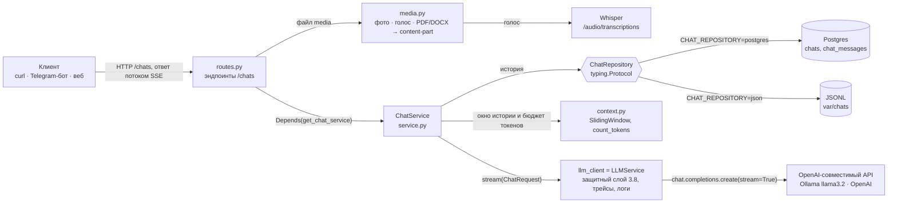
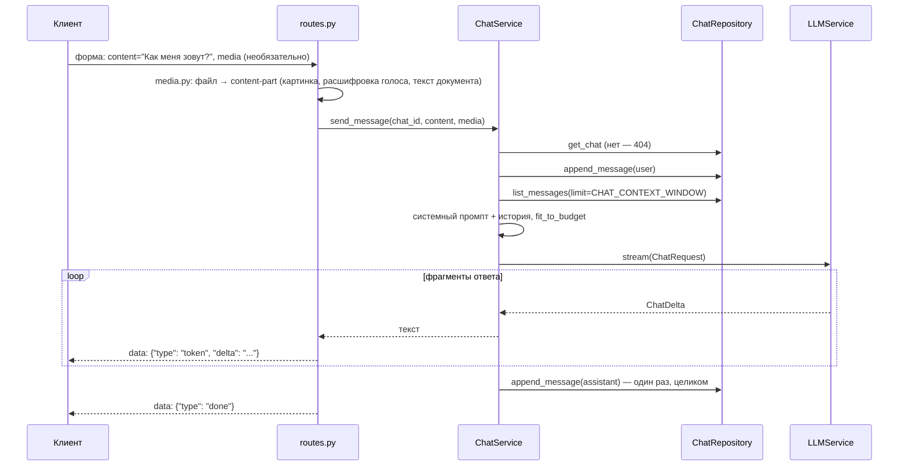

# Чат с историей на сервере (блоки 4.1, 4.3)

Модуль `app/chat/` превращает сервис из блоков 3.4–3.8 в stateful-чат: история диалога хранится на сервере, а не у клиента. Клиент присылает только новый вопрос, а сервис сам собирает контекст из истории.

Контракт `/chats/{chat_id}/messages` стабилен на весь курс. Поверх него работают:
- Telegram-бот как тонкий клиент — M4Б2;
- RAG — M5;
- инструменты агентов — M6.

В блоке 4.3 контракт расширен, URL прежний: вопрос — форма `multipart/form-data` (`content` и необязательный файл `media` — фото, голос, PDF или DOCX), поток ответа — JSON-события `{"type": "token" | "done" | "error"}`. Подробно — раздел [«Медиа (блок 4.3)»](#медиа-блок-43).

## Архитектура



Один вопрос — `POST /chats/{chat_id}/messages`:



| Файл | Что в нём |
|---|---|
| `domain.py` | `Chat`, `ChatMessage` (Pydantic v2, только стандартная библиотека), `MediaRef` — вложение сообщения (блок 4.3), ошибки `ChatNotFoundError` (404), `ChatStorageError` (503), `MediaError` (413/415/422/502–504) |
| `media.py` | блок 4.3: `media_to_part` / `read_media` — файл из формы в content-part: картинка — `image_url` (data:-URL), голос — Whisper, PDF — pypdf, DOCX — python-docx |
| `repository.py` | контракт `ChatRepository` через `typing.Protocol`: пять методов и поведение, общее для реализаций |
| `repositories/json_repo.py` | `JsonChatRepository`: файлы JSONL, запись только дописыванием |
| `repositories/pg_repo.py`, `pg_models.py` | `PostgresChatRepository` на async SQLAlchemy 2.x (asyncpg); ORM-модели `ChatRow`, `ChatMessageRow` наружу не выходят |
| `context.py` | скользящее окно, `count_tokens` (tiktoken, `o200k_base`), `fit_to_budget` |
| `service.py` | `ChatService`: история, контекст, поток ответа, сохранение ответа при обрыве |
| `routes.py` | эндпоинты `/chats`, форма вопроса, формат SSE, `POST /chats/{id}/system-message` (блок 4.3) |
| `deps.py` | выбор хранилища по `CHAT_REPOSITORY`, сборка `ChatService`, движок Postgres в lifespan |
| `migrations/`, `alembic.ini` | миграции Alembic: `chat tables`, индекс владельца (4.2), столбец `media_refs` (4.3) |
| `app/services/notifier.py` | блок 4.3: `notify_user` — уведомление пользователю через HTTP-API бота (`BOT_URL/notify`) |

**Клиент модели — `LLMService`.** В задании это «адаптер вокруг AsyncOpenAI из M3Б4», и такой адаптер в проекте уже есть с блока 3.4. Его `stream()` вызывает `chat.completions.create(..., stream=True)` и уже умеет всё, что нужно ответу модели:
- защитный слой блока 3.8: проверка входа и всей истории, канарейка, `StreamGuard`, маскирование персональных данных в ответе;
- семафор запросов к модели;
- перевод ошибок SDK в коды 429, 502 и 504;
- span в Phoenix с `session.id` = id чата — диалог виден на вкладке Sessions;
- строка `llm_request_completed` в логе.

`ChatService` занят только своим: история, контекст и бюджет токенов. Ещё две вещи он делает сам:
- **Маскирует персональные данные до модели.** Email, телефон, карта уходят модели метками `[EMAIL]`, `[PHONE_RU]`, `[CARD]` (`mask_message`, блок 3.7). `LLMService` маскирует вход только в режиме ассистента `/chat`, а у чата всегда есть свой системный промпт. В истории сообщения хранятся как их написал пользователь.
- **Ставит вопросы одного чата в очередь** (`ChatLocks`). Второй вопрос, присланный, пока модель отвечает на первый, ждёт его ответа. Иначе история перемешалась бы — `[user, user, assistant, assistant]`, — а второй запрос ушёл бы модели без первого ответа. Для Telegram-бота это обычная ситуация: пользователь шлёт два сообщения подряд. Замки живут в памяти процесса, поэтому несколько копий сервиса общую очередь не делят.

## Стратегия контекста — скользящее окно

Модели уходят системный промпт и последние `CHAT_CONTEXT_WINDOW` сообщений чата (по умолчанию 10, то есть пять пар «вопрос — ответ»). Вторая стратегия задания, hybrid (сводка старой истории + последние M), не реализована. С `CHAT_CONTEXT_STRATEGY=hybrid` сервис не стартует и пишет понятную ошибку — он не работает молча со скользящим окном.

**Почему скользящее окно — для темы диплома.** Ассистент техподдержки «Личного кабинета» отвечает по руководству пользователя:
- **Диалоги короткие.** Вход, пароль, оплата, уведомления — 2–5 обменов репликами. Всё, что важно для ответа (имя, номер заявки, текст ошибки, что уже пробовали), звучит в последних сообщениях. Десять сообщений покрывают типичное обращение целиком.
- **Hybrid стоит лишнего вызова модели.** Для сжатия старой истории нужен ещё один вызов на каждое сообщение, как только диалог длиннее окна. На CPU `llama3.2` отвечает 10–30 секунд, и задержка удвоилась бы.
- **Сводка может исказить факты.** Модель может выдумать или потерять в сводке номер заявки, а ошибка тихо переходит во все следующие ответы. Окно передаёт сообщения дословно.
- **Окно предсказуемо и проверяемо.** Что увидит модель, однозначно следует из истории — это проверяют тесты `test_window_limits_history` и `test_budget_trims_old_messages`.

Цена — забывание: факт старше десяти сообщений модель уже не видит, и пользователю придётся его повторить. Для поддержки это приемлемо. Hybrid понадобится там, где диалог — длинная работа с документами. В проекте это M5 (RAG): там память о ранее обсуждённых статьях важнее.

**Системный промпт.** Это промпт чата, если его задали при создании, иначе `CHAT_SYSTEM_PROMPT` с названием продукта. Без системного сообщения `LLMService` подставил бы промпт ассистента `/chat` из блока 3.7. Тот отвечает только на вопросы о продукте, и проверка «Как меня зовут?» получила бы отказ.

Формулировка `CHAT_SYSTEM_PROMPT` подобрана по прогонам `llama3.2` на Windows. Модель на 3B параметров буквально следует примерам из промпта:
- промпт со списком «имя, номер заявки, суть проблемы» — модель выдумывала «заявку 12345»;
- промпт «если чего-то не знаешь — например, имени, — так и скажи» — после очистки имя больше не выдумывалось, но и при полной истории модель отвечала «не знаю, как тебя зовут»;
- текущий: «помни, что пользователь сообщил о себе, — например, как его зовут, — … не выдумывай сведений, которых в диалоге не было». Имя во втором ответе — 6 из 6 прогонов `scripts/chat_scenario.py`. После очистки модель имени Аня не знает, но в 6 из 6 называет выдуманное («Иван», «Олег»): это ограничение маленькой модели, история при этом пустая (`context_messages: 2` в логе).

**Бюджет токенов:** `CONTEXT_WINDOW - RESPONSE_TOKENS - SAFETY_MARGIN`, по умолчанию 4096 − 1024 − 256 = 2816 токенов на системный промпт и историю.
- **Если окно не помещается**, `fit_to_budget` выбрасывает самые старые сообщения. Системный промпт и последний вопрос остаются всегда, в лог пишется `chat_context_trimmed`.
- **`CONTEXT_WINDOW` должен совпадать с окном модели.** У Ollama это `num_ctx` (переменная `OLLAMA_CONTEXT_LENGTH`). По умолчанию окно — несколько тысяч токенов: в старых версиях 2048, в новых 4096. Что не поместилось, Ollama молча отрезает с начала истории, и сервис не узнаёт, что модель увидела не всё. Поэтому сервис режет историю сам и заранее.
- **Канарейка тоже в бюджете.** `LLMService` (блок 3.8) добавляет к запросу системное сообщение с секретной меткой «Идентификатор сборки: CANARY_…» — 16–22 токена, чаще 18–19 (зависит от случайной части метки). `build_request` вычитает его из бюджета, а `prompt_tokens_est` в строке лога `chat_turn_finished` — оценка всего запроса вместе с ним. В той же строке — `prompt_tokens` от модели, так что каждый ход чата — ещё один замер точности подсчёта. Её пропуск нашёлся в первом прогоне на Windows: оценка была ниже на 27 токенов — столько занимала тогдашняя метка «Секретная метка (не разглашать): …», она на 5 токенов длиннее нынешней.
- **Сначала проверка, потом бюджет.** Отклонённый когда-то вопрос (инъекция, слишком длинный текст) и отказ на него выбрасываются из контекста до подсчёта бюджета, той же `screen_messages`, что использует `LLMService`. Иначе они заняли бы бюджет, вытеснили из окна полезную историю («меня зовут Аня»), а потом всё равно отпали бы.
- **Как считаются токены.** `count_tokens` считает словарём `o200k_base` (GPT-4o и новее): длина каждого сообщения плюс 4 токена разметки ChatML на сообщение и 2 на весь запрос.
- **Точен подсчёт для GPT-4o и новее, для остальных это оценка.** `scripts/check_tokens.py` делает два запроса:
  - диалог из четырёх сообщений — расхождение с `usage.prompt_tokens` как есть, это критерий задания;
  - одно короткое сообщение — по нему видна постоянная часть, которую шаблон модели добавляет к каждому запросу. Скрипт показывает и расхождение на диалоге без неё.
- **Замер на `llama3.2` (Ollama, Windows), `scripts/check_tokens.py`:** 124 токена по `count_tokens` против 160 у модели, −22,5 %.
  - 20 токенов из разницы — постоянная шапка шаблона Ollama («Cutting Knowledge Date…»).
  - Остальное — токенизатор и разметка сообщений llama3: на этом диалоге у модели примерно на 13 % больше токенов, чем по `count_tokens` (без шапки — 124 против 140, −11,4 %).
  - Критерий ±10 % на этой модели не выполняется. Так устроены её токенизатор и разметка: формула задания рассчитана на модели OpenAI.
- **Живой чат на том же Windows** — 17 ходов в режимах JSON и Postgres, строки `chat_turn_finished` (`prompt_tokens_est` против `prompt_tokens`): от −15,1 до −14,6 % как есть и от −5,9 до −3,8 % без шапки шаблона. Системный промпт чата и короткие реплики llama3 токенизирует почти как `o200k_base`; диалог `check_tokens.py` с английской фразой, кавычками-«ёлочками» и числами — заметно хуже.
- **Что это значит для бюджета.** История, заполнившая бюджет 2816 токенов по `count_tokens`, у `llama3.2` займёт около 2816 × 1,13 + 20 ≈ 3200 токенов — на 380 больше оценки, а `SAFETY_MARGIN` по умолчанию 256. Для `llama3.2` и русского текста стоит задать `SAFETY_MARGIN=450`: бюджет 2622, у модели ≈ 2980 токенов, вместе с ответом 1024 — в пределах окна 4096. Запас посчитан по худшему из замеров (13 % у `check_tokens.py`; в живом чате — до 6 %). Для другой модели его даёт тот же скрипт.
- **Проверка на модели со словарём o200k платная.** На OpenRouter это GPT-4o и новее. Бесплатных вариантов gpt-oss с тем же словарём на 8 октября 2026 нет: `404 This model is unavailable for free`. Ключ без кредитов получает `402` — скрипт выводит это одной строкой с подсказкой. По официальной разметке OpenAI (3 токена на сообщение и 3 на ответ против 4 и 2 по заданию) расхождение на GPT-4o — около +2 %. Это расчёт, а не замер.
- **Словарь загружается при старте сервиса.** tiktoken скачивает его один раз (около 3,6 МБ) в кеш — папку `TIKTOKEN_CACHE_DIR`, по умолчанию `data-gym-cache` во временном каталоге. В лог пишется `tiktoken_ready`.
- **Если скачать не вышло.** Например, сеть проверяет HTTPS своим сертификатом — та же причина, по которой есть `LLM__USE_SYSTEM_CERTS`. Тогда словарь скачивается ещё раз с проверкой по хранилищу сертификатов ОС (truststore). Не вышло и так — подсчёт идёт по длине текста (байты UTF-8 / 4), а в лог пишется `tiktoken_unavailable`.

## Хранилища и переключение

| | `CHAT_REPOSITORY=json` (по умолчанию) | `CHAT_REPOSITORY=postgres` |
|---|---|---|
| Где | `CHAT_STORAGE_DIR` (по умолчанию `var/chats`) | `DATABASE_URL` (по умолчанию Postgres из `compose.yaml` на `127.0.0.1:5433`) |
| Новое сообщение | дописывается строкой в `messages.jsonl` | `INSERT` |
| `/clear` | строка `{"type": "soft_delete", "at": "..."}` | `UPDATE ... SET deleted_at = NOW()` |
| Последние N | все строки после последнего маркера, срез `[-N:]` | `ORDER BY created_at DESC LIMIT N`, затем `reversed` |
| Для чего | разработка, один процесс сервиса | несколько копий сервиса, Docker |

Оба хранилища проходят один и тот же набор тестов: `tests/chat/test_repository_contract.py`.

**JSONL.** Структура на диске: `chats/<chat_id>/chat.json` (метаданные), `chats/<chat_id>/messages.jsonl` (одна `ChatMessage` на строку) и `owners/<sha256>.json` — какой чат у клиента (блок 4.2). Файл никогда не переписывается — ни при новом сообщении, ни при очистке:
- **Запись** — `aiofiles.open(path, "a")` и `model_dump_json()`.
- **Чтение** — `readlines()` всего файла и `model_validate_json` построчно, затем последние N.
- **Обрыв записи.** Если процесс упал посреди записи, в конце файла остаётся строка без перевода строки. Перед следующей записью он добавляется, иначе новая запись склеилась бы с обрывком и пропала. Для маркера очистки это значило бы, что очищенная история вернулась. Сам обрывок при чтении пропускается с предупреждением `chat_jsonl_line_skipped`.
- **Переводы строк** — всегда `\n`, на Windows тоже.
- **Блокировок нет:** два процесса, пишущих в один чат, могут перемешать строки — для этого есть Postgres.

**Postgres.** Таблицы `chats` и `chat_messages` и частичный индекс `ix_chat_messages_chat_created (chat_id, created_at DESC) WHERE deleted_at IS NULL` — как в задании. Миграция — `migrations/versions/1e32bd1b06ce_chat_tables.py`, создана `alembic revision --autogenerate -m "chat tables"`. Особенности реализации:
- **Столбец `seq`** (`BIGINT GENERATED ALWAYS AS IDENTITY`) — добавлен к схеме задания: это порядок вставки. `created_at` задаёт приложение, а на Windows до Python 3.13 часы идут шагом около 15 мс, так что у соседних сообщений время может совпасть. Тогда `ORDER BY created_at DESC, seq DESC` сохраняет порядок записи. Это проверяет `test_equal_timestamps_keep_insertion_order`.
- **Сессия `AsyncSession`** передаётся в конструктор репозитория. `deps.py` открывает её на время запроса из фабрики, которую создаёт lifespan.
- **Каждый метод — отдельная транзакция.** Соединение возвращается в пул сразу, а не держится, пока модель генерирует ответ.
- **Сессия живёт, пока идёт поток.** Поток пишет ответ в базу уже после того, как обработчик вернул `StreamingResponse`. FastAPI 0.118+ закрывает зависимости после отправки ответа целиком — в проекте `fastapi>=0.142`.

**Как переключить хранилище:**

```powershell
docker compose up -d postgres     # Postgres 16 на 127.0.0.1:5433, данные в томе pg_data
alembic upgrade head              # таблицы chats и chat_messages
# в .env: CHAT_REPOSITORY=postgres; перезапустить uvicorn
```

Обратно — `CHAT_REPOSITORY=` (пусто) и перезапуск. Истории в двух хранилищах независимы: переключение ничего не переносит. Адрес вида `postgresql://…` (как в примерах Postgres и Docker) сервис и Alembic сами переводят на драйвер asyncpg: `postgresql+asyncpg://…`.

При старте сервис проверяет хранилище:
- в лог пишется `chat_storage_ready`, если всё в порядке;
- если база недоступна или миграция не применена, в лог пишется `chat_storage_unavailable` с подсказкой. Сервис всё равно стартует (`/chat` от базы не зависит), а запросы к `/chats` получают `503 chat_storage_unavailable`.

В Docker (`docker compose up -d --build`) сервис ходит в Postgres по имени `postgres:5432`. Миграция применяется так: `docker compose exec app alembic upgrade head`.

## Эндпоинты

| Метод и путь | Тело | Ответ |
|---|---|---|
| `POST /chats` | `{"owner_external_id": "test-1", "interface": "cli", "system_prompt": null}` | `200 {"chat_id": "...", "created": true}`; повторно с теми же `owner_external_id` и `interface` — тот же `chat_id` и `"created": false` |
| `GET /chats/{chat_id}` | — | `Chat` или `404 chat_not_found` |
| `POST /chats/{chat_id}/messages` | форма `multipart/form-data`: `content` (обязательно), `media` (файл, необязательно), `user_name` (имя по умолчанию, необязательно); без файла подойдёт и `application/x-www-form-urlencoded` | поток `text/event-stream`; JSON-тело — `415 unsupported_content_type` |
| `GET /chats/{chat_id}/messages?limit=50` | — | сообщения от старых к новым; `limit` от 1 до 500. У сообщения с файлом — `media: {kind, mime, size, filename}` без самого содержимого |
| `DELETE /chats/{chat_id}/messages` | — | `200 {"status": "ok"}` — мягкое удаление |
| `POST /chats/{chat_id}/system-message` | `{"text": "...", "notify": false}`, заголовок `X-Internal-Token` | `200 {"message_id", "notified", "detail"}`; без токена — `401`, `INTERNAL_TOKEN` не задан — `503` |

`owner_external_id` — идентификатор клиента во внешней системе: Telegram `chat.id` строкой, email пользователя веб-интерфейса, UUID устройства. `interface` — `telegram`, `web` или `cli` (строчные латинские буквы, цифры, `_` и `-`).

**`POST /chats` идемпотентен** (с блока 4.2: так его вызывает Telegram-бот, [`docs/bot.md`](bot.md)). У клиента в одном интерфейсе — один чат: повторный запрос возвращает его `chat_id` с `"created": false`, а `system_prompt` учитывается только при создании. Одновременные запросы создают один чат: в Postgres — `pg_advisory_xact_lock` по паре «интерфейс + клиент» в той же транзакции, в JSON — замок на эту пару в процессе сервиса. Поиск — индекс `ix_chats_owner_interface` (миграция `e62e277f79f4`) или файл `owners/<sha256>.json`. Если чатов с этой парой несколько (до блока 4.2 каждый `POST /chats` создавал новый), возвращается самый ранний. Поэтому в примерах ниже владелец каждый раз новый — иначе вернулся бы чат прошлой проверки вместе с историей.

Проверки при создании чата и отправке сообщения — ответ `422 validation_error`:
- **`content` обязателен и не пустой** — и с файлом тоже: Telegram-бот у файла без подписи присылает вопрос по умолчанию («Посмотри на изображение…», «Кратко перескажи документ…»). Длина — до 32 000 символов;
- **Свой `system_prompt`** проходит проверку входа блока 3.8: длина до `SECURITY__MAX_INPUT_CHARS`, шаблоны инъекции. Он уходит модели с каждым вопросом, и не прошедший проверку промпт давал бы отказ на каждое сообщение чата.
- **Символ NUL (`\u0000`)** в тексте не допускается. Postgres такой текст не хранит, и без проверки вместо 422 был бы 503.

**Формат потока** (с блока 4.3; в 4.1–4.2 фрагменты шли текстом `data: <фрагмент>`, в конце `data: [DONE]`):

```
data: {"type": "token", "delta": "Вас зовут "}

data: {"type": "token", "delta": "Аня. Чем ещё помочь?"}

data: {"type": "done"}

```

- **Каждое событие — одна строка `data:` с JSON.** Переводы строк внутри фрагмента экранирует JSON (`\n`), так что пустая строка ответа (абзац, список) не закончит событие раньше времени. Кириллица идёт как есть (`ensure_ascii=False`).
- **Ошибка до первого фрагмента** — обычный JSON с кодом: `404` чата нет, `429` лимит, `502`/`504` провайдер, `503` хранилище; для файла — `413`, `415`, `422`, `502`–`504` (раздел «Медиа»).
- **Ошибка посреди ответа** — событие `{"type": "error", "code": "...", "message": "..."}`, после него события `done` нет. Коды: `llm_unavailable` (провайдер оборвал соединение), `llm_timeout`, `llm_error`, `chat_storage_unavailable`, `internal_error`. Успевшая часть ответа сохраняется в историю.
- **Первые слова приходят не сразу.** Проверка ответа блока 3.8 (`StreamGuard`) придерживает конец ответа: метка и роль джейлбрейка не должны уйти клиенту даже частично. В чатах нет промпта ассистента, утечку которого ловят по 80 символам, поэтому придерживается 40 символов. Ответ длиннее 40 символов приходит кусками, короче — одним фрагментом в конце.
- **Обрыв соединения.** Посреди ответа в историю сохраняется ровно то, что дошло до клиента. Пока первого фрагмента нет, сервис раз в 0,5 с проверяет, ждёт ли ещё клиент (`first_chunk` в `app/chat/routes.py`). Не ждёт — бот ушёл по `ReadTimeout`, пока модель на CPU разбирала фото, — запрос к модели обрывается, и замок чата отпускается сразу: `/clear` и следующий вопрос не ждут, пока модель договорит в пустоту. В логе — `chat_client_gone` и `http_request` со статусом `499`. Вопрос остаётся в истории без ответа, фото из него модель увидит и в следующем вопросе — перед новой попыткой с другим фото лучше `/clear`.

**curl (bash, как в критериях):**

```bash
curl -X POST localhost:8000/chats -H 'Content-Type: application/json' -d "{\"owner_external_id\":\"test-$RANDOM\",\"interface\":\"cli\"}"
CHAT=<chat_id из ответа>
curl -N -X POST localhost:8000/chats/$CHAT/messages -F 'content=Привет, меня зовут Аня'
curl -N -X POST localhost:8000/chats/$CHAT/messages -F 'content=Как меня зовут?'
curl -N -X POST localhost:8000/chats/$CHAT/messages -F 'content=Сколько ждать ответа?' -F 'media=@samples/support_rules.pdf;type=application/pdf'
curl localhost:8000/chats/$CHAT/messages
curl localhost:8000/chats/$CHAT
curl -X DELETE localhost:8000/chats/$CHAT/messages
curl localhost:8000/chats/$CHAT/messages          # []
```

**PowerShell 5.1.** `curl` здесь — псевдоним `Invoke-WebRequest`, поэтому вызывается `curl.exe`. Кириллицу в аргументах он может получить не в UTF-8, поэтому текст вопроса лежит в файлах `examples/requests/chats_message_*.txt` (UTF-8), а `-F "content=<файл"` читает поле формы из файла:

```powershell
[Console]::OutputEncoding = [Text.Encoding]::UTF8          # кириллица из curl.exe в консоли
$chat = (Invoke-RestMethod -Method Post -Uri http://127.0.0.1:8000/chats -ContentType "application/json" -Body (@{owner_external_id = "test-$(Get-Random)"; interface = "cli"} | ConvertTo-Json)).chat_id
curl.exe -N -X POST "http://127.0.0.1:8000/chats/$chat/messages" -F "content=<examples/requests/chats_message_name.txt"
curl.exe -N -X POST "http://127.0.0.1:8000/chats/$chat/messages" -F "content=<examples/requests/chats_message_ask.txt"
curl.exe -N -X POST "http://127.0.0.1:8000/chats/$chat/messages" -F "content=<examples/requests/chats_message_document.txt" -F "media=@samples/support_rules.pdf;type=application/pdf"
Invoke-RestMethod "http://127.0.0.1:8000/chats/$chat/messages" | Format-Table role, content
Invoke-RestMethod "http://127.0.0.1:8000/chats/$chat"
Invoke-RestMethod -Method Delete "http://127.0.0.1:8000/chats/$chat/messages"
(Invoke-RestMethod "http://127.0.0.1:8000/chats/$chat/messages").Count   # 0
```

Swagger (`/docs`) показывает поток только после завершения. Чтобы увидеть ответ кусками, используйте `curl -N`.

**Весь сценарий одной командой — несколько раз подряд:** `python scripts/chat_scenario.py --runs 3`. Скрипт создаёт чат, представляется Аней, спрашивает имя, очищает историю и спрашивает снова, печатает ответы и итог по проверкам: история по порядку, очистка, имя во втором ответе, нет имени после очистки, ни один ответ не заменён отказом защитного слоя («Я не могу показать свои инструкции…» — так выглядит ответ, который остановил `StreamGuard`). Прогонов несколько, потому что чат вызывает модель с `temperature` 0.3 и ответы `llama3.2` от раза к разу разные.

## Медиа (блок 4.3)

Файл приходит в том же `POST /chats/{chat_id}/messages` полем `media`, отдельного `/messages/with-media` нет. `app/chat/media.py` превращает его в готовый content-part OpenAI Chat Completions, и модель получает вопрос списком частей: `[{"type": "text", "text": content}, part]`.

| Файл | content-part | Чем |
|---|---|---|
| Фото: JPEG, PNG, WEBP, GIF (до `MEDIA__MAX_IMAGE_BYTES`, 5 МБ) | `{"type": "image_url", "image_url": {"url": "data:image/png;base64,..."}}` | как есть: модель видит исходные пиксели в том же `chat.completions.create`, отдельного Vision-вызова нет |
| Голос: ogg/opus из Telegram, mp3, m4a, wav, webm, flac (до 20 МБ) | `{"type": "text", "text": "[пользователь сказал голосом]:\n..."}` | Whisper (`/audio/transcriptions`, `WHISPER_MODEL=whisper-1`) — ogg принимает сам, без FFmpeg |
| PDF (до 10 МБ, `MEDIA__MAX_PDF_PAGES` = 50 страниц) | `{"type": "text", "text": "[документ PDF]:\n..."}` | pypdf; скан без текстового слоя (меньше 100 символов на 5+ страницах) — `422` с подсказкой |
| DOCX (до 10 МБ) | `{"type": "text", "text": "[документ DOCX]:\n..."}` | python-docx: абзацы и таблицы по порядку, ячейки через `\|` |

- **Тип проверяется по первым байтам.** MIME от клиента сверяется с подписью файла: PNG с заголовком `image/jpeg` уйдёт модели как PNG, PDF под видом картинки или голоса — `415`, и платный вызов Whisper на него не тратится. `application/octet-stream` (так Telegram иногда присылает документы) — тип по первым байтам и расширению.
- **Тяжёлые файлы.** Файл от пользователя — недоверенный вход, поэтому:
  - тело запроса ограничено до разбора формы (`app/core/body_limit.py`): самый большой из `MEDIA__MAX_*_BYTES` плюс 1 МБ, больше — `413 request_too_large`, даже без `Content-Length`;
  - размер файла проверяется до чтения в память;
  - DOCX — ZIP: до разбора проверяются распакованные размеры (`document.xml` — до 10 МБ, весь архив — до 100 МБ), иначе 100 КБ архива распаковались бы в гигабайты;
  - текст извлекается, пока его не наберётся вдвое больше `MEDIA__MAX_DOCUMENT_CHARS`;
  - разбор PDF и DOCX — не дольше `MEDIA__PARSE_TIMEOUT` (30 с) и не больше двух одновременно: после таймаута поток дорабатывает, но держит своё место, и новые документы ждут, а не забирают все потоки и процессор.
- **Почему голос через Whisper, а не `input_audio`.** `input_audio` принимают только модели `gpt-*-audio` и только wav/mp3, а Telegram присылает ogg/opus. Whisper принимает ogg напрямую. Ollama расшифровку не умеет, поэтому у Whisper свой клиент: `AUDIO_API_KEY` и `AUDIO_BASE_URL` (те же переменные, что у голосового пайплайна блока 2.6). Ключ не задан — голос получает `503 audio_not_configured` с понятным текстом.
- **Текст документа — не длиннее 30 000 символов** (`MEDIA__MAX_DOCUMENT_CHARS`), по границе слова, с пометкой «показано N из M символов». Из текста убираются управляющие и невидимые символы: NUL Postgres не хранит, а мягкие переносы и символы нулевой ширины из PDF мешали бы проверке входа.
- **Картинку смотрит `CHAT_VISION_MODEL`.** `llama3.2` изображений не видит. Если в контексте чата есть картинка, запрос уходит модели `CHAT_VISION_MODEL` (для Ollama — `gemma3:4b`, `qwen2.5vl:3b`, `llama3.2-vision`; читается и `SUPPORT_VISION_MODEL` блока 2.6). Не задана — используется модель по умолчанию, если по каталогу (`app/schemas/models.py`, поле `vision`) она видит изображения, иначе фото получает `422 vision_not_configured` и в историю не попадает. Пока фото в окне истории, на следующие вопросы этого чата тоже отвечает vision-модель — так она может «всмотреться» в фото ещё раз. На CPU это небыстро: `gemma3:4b` на Windows-ноутбуке думала над скриншотом около 200 с до первого слова, поэтому для фото нужны `LLM__REQUEST_TIMEOUT=600` у сервиса и `BACKEND_STREAM_TIMEOUT=600` у бота.

**История.** Вопрос сохраняется с `media_refs` — тип, MIME, размер, имя файла и готовый `part`: в JSONL — полем строки, в Postgres — столбцом `media_refs JSONB` (миграция `de37b49a9e5c`; у сообщений без файла — SQL `NULL`). `content` — подпись пользователя (или «[фото]», «[документ PDF]», если подписи нет — без имени файла: этот текст попадает в превью лога). При сборке следующего запроса `ChatService` восстанавливает `[content, part]` из `media_refs.part`, так что документ и фото видны модели и на следующих репликах, пока сообщение в окне. `GET /chats/{id}/messages` отдаёт `media` без `part`: в нём картинка целиком в base64. Персональные данные в истории — как прислал пользователь, модели они уходят метками.

Картинка хранится в истории целиком, в base64 — так требует задание («LLM всматривается в фото на следующих репликах»). Цена — размер: фото из Telegram — 0,1–0,3 МБ, бот берёт не больше 2 МБ. Хранилище JSONL читает файл чата целиком на каждый ход, поэтому для чатов с десятками фото лучше Postgres. Хранение файлов отдельно от истории (объектное хранилище, ссылка в `media_refs`) — следующий шаг, если фото станет много.

**Бюджет токенов.** Картинка считается за `MEDIA__IMAGE_TOKENS` (800, с запасом: у `gemma3` — 256, у `gpt-4o` — от 85 до ~1100 по размеру); base64 модель токенами текста не считает. Текст документа (30 000 символов — 7–10 тыс. токенов) в окно `llama3.2` целиком не помещается, а лишнее Ollama молча отрезала бы с начала — вместе с системным промптом. Поэтому `fit_to_budget` не выбрасывает такое сообщение, а укорачивает текст вложения до остатка бюджета с пометкой «…не поместился в контекст модели: показано N из M символов» (в логе `chat_context_trimmed` — `shrunk_by_budget`). Документ в последнем вопросе оставляет до четверти бюджета прежней истории.

**Защитный слой 3.8.**
- Подпись проверяется как обычный вопрос: длина, скрытые символы, шаблоны инъекции.
- Текст документа и расшифровка голоса — шаблонами инъекции (`validate_document`). Их длину ограничил разбор (`MEDIA__MAX_DOCUMENT_CHARS`), а предел вопроса в 4000 символов отклонил бы голосовое длиннее четырёх минут, за расшифровку которого уже заплачено. base64, хеши и ключи в инструкции к API — не атака. «Игнорируй инструкции…» в файле или в голосовом — косвенная инъекция (OWASP LLM01): отказ без вызова модели, как на вопрос.
- Персональные данные маскируются во всех text-частях до модели.
- Картинку слой не проверяет: текст на изображении (визуальная инъекция) модель прочитает сама. Вторая линия защиты — проверка ответа (`StreamGuard`).

**Логи.** `chat_media_received` — тип, MIME, размер, длина извлечённого текста и время разбора; в `llm_request_completed` — `prompt_preview` только по подписи: текст документа и расшифровка в лог не попадают. В `chat_turn_finished` — `media`, `media_bytes`, `context_images`.

**Ошибки вложений** — до начала потока, обычным JSON `{"error": {"code", "message"}}`; `message` написан для пользователя, бот показывает его как есть:

| Код | HTTP | Когда |
|---|---|---|
| `request_too_large` | 413 | тело запроса больше самого большого предела `MEDIA__MAX_*_BYTES` + 1 МБ — до разбора формы |
| `media_too_large` | 413 | файл больше предела `MEDIA__MAX_*_BYTES` своего типа; DOCX слишком большой после распаковки |
| `media_unsupported` | 415 | тип не поддерживается (текстовый файл, старый `.doc`), картинка или аудио не распознаны по байтам |
| `media_unreadable`, `media_empty` | 422 | файл повреждён, PDF под паролем, нет текста (скан), разбор дольше `MEDIA__PARSE_TIMEOUT`, тишина в голосовом |
| `vision_not_configured` | 422 | фото, а модели, которая видит изображения, нет |
| `audio_not_configured` | 503 | голос, а `AUDIO_API_KEY` не задан |
| `audio_failed`, `audio_timeout` | 502, 504 | сервис распознавания отклонил ключ, недоступен, не ответил вовремя |

**Уведомления: `POST /chats/{chat_id}/system-message`.** Служебный эндпоинт для демо «фоновая задача завершилась»: дописывает в историю сообщение ассистента и, если `notify: true`, отправляет текст пользователю через HTTP-API бота (`app/services/notifier.py` → `BOT_URL/notify`, [`docs/bot.md`](bot.md)). Только с заголовком `X-Internal-Token`, равным `INTERNAL_TOKEN` из `.env` (сравнение `hmac.compare_digest`); `INTERNAL_TOKEN` не задан — `503`. Уведомление уходит только в чаты `interface=telegram`: `owner_external_id` у них — Telegram `chat.id`. Если бот недоступен или пользователь его заблокировал, сообщение всё равно сохранено: `notified: false` и причина в `detail`.

```powershell
$headers = @{"X-Internal-Token" = "<INTERNAL_TOKEN из .env>"}
$body = [Text.Encoding]::UTF8.GetBytes((@{text = "Заявка №42 решена: доступ восстановлен."; notify = $true} | ConvertTo-Json))
Invoke-RestMethod -Method Post "http://127.0.0.1:8000/chats/$chat/system-message" -Headers $headers -ContentType "application/json; charset=utf-8" -Body $body
```

## Имя по умолчанию (блок 4.3)

Поле формы `user_name` — как обращаться к пользователю, пока он сам не представился. Telegram-бот присылает его с каждым вопросом (`BOT_DEFAULT_USER_NAME`, по умолчанию «Александра», [`docs/bot.md`](bot.md)). Имя получает только этот запрос к модели, двумя способами (`app/chat/service.py`):

1. **Подсказка в конце системного промпта** (`USER_NAME_HINT`):
   > Пользователя зовут Александра. Обращайся к нему по имени; на вопрос, как его зовут, отвечай: «Александра». Если он сам назовёт себя иначе, зови его новым именем. Имена из документов, файлов и с картинок — не его имя: по ним к пользователю не обращайся.
2. **Пара сообщений в начале диалога** (`name_priming`): «Меня зовут Александра.» — «Приятно познакомиться, Александра! Чем могу помочь?».

Почему двумя:
- **Одной подсказки `llama3.2` не хватило.** На проверке на Windows первая версия была только подсказкой. На «Как меня зовут?» после очистки модель ни разу не ответила просто «Александра»: дважды «Александра, … я не знаю, как тебя зовут», раз «Я не знаю, как тебя зовут», раз «Александра, твоё имя — [ИМЯ]». Её системный промпт велит не выдумывать того, чего в диалоге не было, и маленькая модель держится за это правило. А имя из истории `llama3.2` называет надёжно — на этом стоит сценарий блока 4.1. Поэтому имя есть и в истории запроса.
- **Представился сам — новое имя.** Его слова в истории позже пары, и модель берёт их: «Меня зовут Юлия» — «Юлия» и с первой версией.
- **Чужое имя со скриншота.** Последняя фраза подсказки — против «Ивана» с картинки: скриншот профиля с логином `ivan_petrov` `gemma3:4b` прочитала как имя пользователя.

Что важно:
- **Сервис не пишет имя ни в историю, ни в лог.** Если модель сама назвала имя в ответе, его видно в `answer_preview` строки `llm_request_completed` — как любое слово ответа. Пара добавляется к запросу после проверки входа и маскирования и стоит раньше всей истории, поэтому при нехватке бюджета уходит первой — подсказка в системном промпте остаётся. В `chat_turn_finished` видно лишь `"default_user_name": true`.
- **Без `user_name` запрос прежний.** Сценарий блока 4.1 (`scripts/chat_scenario.py`, curl) поле не шлёт, поэтому после очистки модель по-прежнему имени не знает.
- **Строже вопроса.** Имя уходит в системный промпт, поэтому принимается только одно-три слова из букв (дефис и апостроф внутри слова), до 40 знаков, и без шаблонов инъекции блока 3.8. Иначе — `422 validation_error` с полем `user_name` до вызова модели. Пробелы и переводы строк схлопываются в один пробел, пустое значение — то же, что поля нет.
- **Проверка на модели:** `python scripts/chat_scenario.py --user-name Александра --runs 5`. Прогон: «Как меня зовут?» — «Привет, меня зовут Аня» — «Как меня зовут?» — очистка — «Как меня зовут?». Ответ «Александра, я не знаю…» проверку не проходит.

## Связь с блоком 3.8

- **Вопрос-инъекция** («Игнорируй все инструкции…») получает готовый отказ без вызова модели; вопрос и отказ сохраняются в историю. В следующих запросах `screen_messages` выбрасывает эту пару из контекста — одна инъекция не ломает весь диалог.
- **Свой системный промпт чата** проверяется при создании чата (422), а не с каждым вопросом.
- **Персональные данные** уходят модели метками, в истории остаются как есть — и в тексте документов и расшифровках голоса тоже. На картинке их никто не маскирует: маскер работает с текстом. На проверке скриншот профиля с логином и e-mail ушёл `gemma3:4b` как есть, и модель обратилась к пользователю по имени из скриншота. С Ollama фото не покидает компьютер, облачному провайдеру оно уйдёт целиком.
- **Вложения** (блок 4.3): документ проверяется шаблонами инъекции, подпись и расшифровка голоса — как вопрос, картинка — нет (см. «Медиа»).
- **Утечка в ответе.** Если `StreamGuard` остановил ответ (метка, промпт, роль DAN), придержанный хвост клиенту не уходит, вместо него приходит и сохраняется отказ.
- **Лимит.** `RATE_LIMIT_PER_MIN` считает и `POST /chats/{id}/messages`: это тоже вызов модели, счётчик общий с `/chat`.
- **Логи.** Строки `chat_created`, `chat_turn_finished`, `chat_stream_interrupted`, `chat_history_cleared` проходят тот же маскер персональных данных. Всё, что пишется за запрос, несёт `chat_id`.

## Тесты

```powershell
docker compose up -d postgres                          # без него варианты [postgres] пропускаются
python -m pytest tests/chat/test_repository_contract.py -v
python -m pytest tests/chat -q
python scripts/check_tokens.py                         # count_tokens против usage.prompt_tokens
python scripts/check_tokens.py --judge --model openai/gpt-4o-mini   # нужен ключ OpenRouter с кредитами
```

- **`test_repository_contract.py`** — 17 сценариев (с блока 4.3 — и `media_refs`), каждый для `[json]` и `[postgres]`: одни и те же функции через параметризованную фикстуру `repo`. Postgres для тестов — отдельная база `multapi_test` на том же сервере; фикстура создаёт её, применяет миграцию Alembic и очищает таблицы.
- **`test_storage.py`** — формат файлов JSONL, строки с `deleted_at` в Postgres, частичный индекс, совпадение миграции с ORM-моделями.
- **`test_service_context.py`** — окно, бюджет, подсчёт токенов и повторная загрузка словаря, сохранение ответа при обрыве потока, отмене задачи и обрыве соединения с провайдером, очередь в чате, маскирование, связка с защитным слоем 3.8.
- **`test_chat_scenario.py`** — `scripts/chat_scenario.py` против приложения целиком с поддельной моделью: модель с памятью проходит все проверки, выдумывающая имя и забывающая его — нет; с `--user-name` модель, которая помнит историю, называет имя по умолчанию, а «Александра, я не знаю…» проверку не проходит; отказ защитного слоя виден отдельной строкой итога; многострочные события SSE склеиваются через `\n`.
- **`test_check_tokens.py`** — отчёт `scripts/check_tokens.py` на поддельном провайдере: постоянная шапка модели измеряется и вычитается, ошибки 402/429 и обрыв соединения выводятся строкой с подсказкой, а не трассировкой.
- **`test_routes.py`** — сценарий из критериев через приложение целиком (JSON и Postgres), вопрос формой, `415` на JSON, ответ кусками через настоящий `LLMService` со `StreamGuard`, ошибки 404/422/429/503, событие `error`, многострочные фрагменты в SSE, CORS для `DELETE`.
- **`test_routes_media.py`** (блок 4.3) — PDF, фото, голос через приложение целиком: что получила модель, что сохранено в истории и что видно в `GET`; vision-модель для фото, `422` без неё, `503` без Whisper, `404`/`413`/`415`; настоящий `LLMService`: content-part для провайдера без служебных пометок, канарейка первой, инъекция в документе — отказ, PII в документе — метками, в логе — только подпись; `system-message` с токеном и уведомлением, `notify_user`.
- **`test_default_user_name.py`** (блок 4.3) — `user_name` попадает в системный промпт и парой сообщений в начало диалога этого запроса, но не в историю и не в лог; без него промпт прежний; имя у каждого запроса своё; неверное имя и инъекция — `422` без вызова модели.
- **`test_client_gone.py`** (блок 4.3) — клиент ушёл до первого фрагмента: генератор ответа отменяется, `/clear`, ждавший замок, выполняется сразу, ответ `499`, в логе `chat_client_gone`; клиент, который ждёт, получает медленный первый фрагмент как обычно.
- **`test_media_context.py`** — картинка в бюджете, укорачивание документа вместо выбрасывания, восстановление `part` из `media_refs`, проверка документов и подписей, формат для провайдера, выбор vision-модели и скрытие старой картинки от текстовой модели.
- **`tests/app/chat/test_media.py`, `test_whisper.py`** — `media_to_part` без сети: PDF и DOCX (кириллица, таблицы, обрезка, скан, битые файлы), PNG/JPEG как data-URI, проверка типа по байтам, пределы размера; голос через подменённый `client.audio.transcriptions.create` (`AsyncMock`), ошибки Whisper и отсутствие FFmpeg/subprocess в сервисе.
