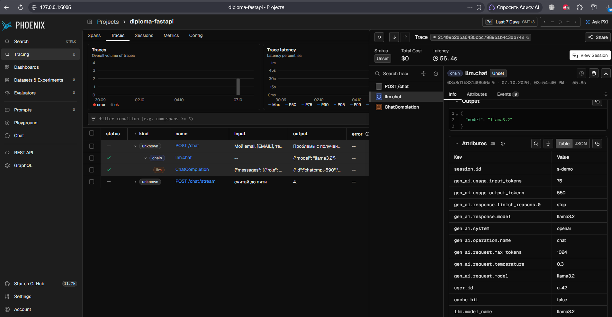
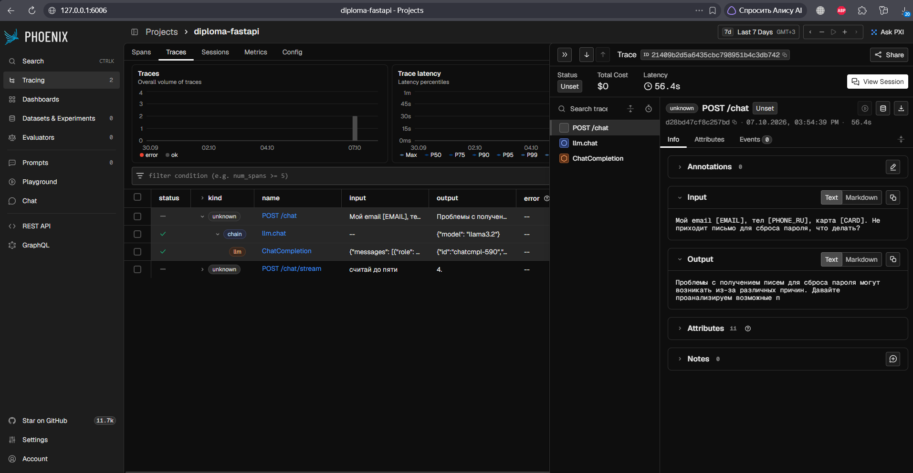
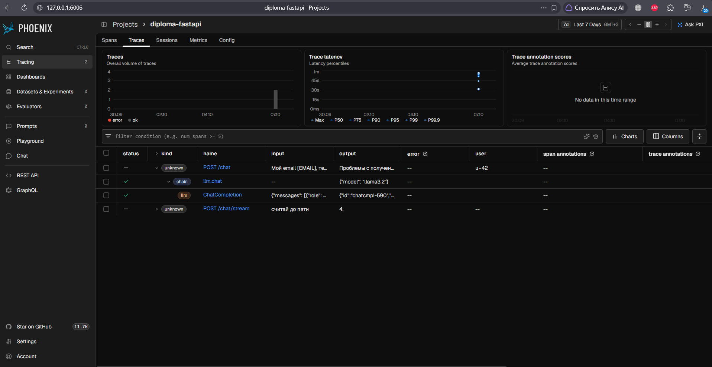
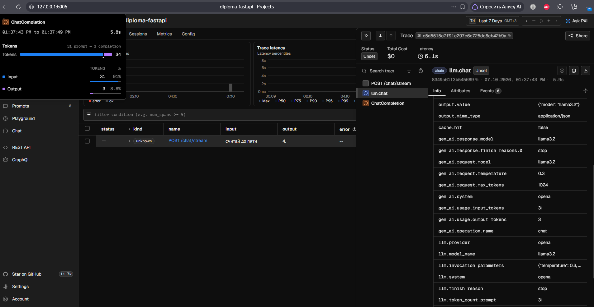

# Трейсы запросов в Phoenix (блок 3.6)

Прогон 7 октября 2026 года: Windows, Docker Desktop, стек `docker compose up -d --build --wait` (app, redis, phoenix), модель `llama3.2` в Ollama на хосте, интерфейс Phoenix — `http://127.0.0.1:6006`.

## Трейс запроса POST /chat

Запрос `X-Request-ID: demo-005`, тело `examples/requests/chat_pii.json`: вопрос о письме для сброса пароля с email, телефоном и номером карты, `user_id: u-42`, `session_id: s-demo`. Кеш перед запросом очищен (`redis-cli flushall`), поэтому ответ пришёл от модели.

### Что видно

1. **Дерево спанов** (в центре): `POST /chat` → `llm.chat` → `ChatCompletion`.
   - `POST /chat` — span HTTP-запроса от FastAPI;
   - `llm.chat` — наш span вызова модели (тип `chain`);
   - `ChatCompletion` — span OpenAI SDK, который создаёт автоинструментация OpenInference.
2. **Шапка трейса:** общее время 56,4 с (модель работает на CPU), стоимость $0 — локальная модель. Кнопка **View Session** открывает все трейсы сессии `s-demo`.
3. **Атрибуты `llm.chat`** (справа):
   - `gen_ai.request.model: llama3.2`, `gen_ai.request.temperature: 0.3`, `gen_ai.request.max_tokens: 1024`;
   - `gen_ai.usage.input_tokens: 76`, `gen_ai.usage.output_tokens: 550`;
   - `gen_ai.response.model: llama3.2`, `gen_ai.response.finish_reasons: stop`;
   - `session.id: s-demo` и `user.id: u-42` — из тела запроса; по `session.id` Phoenix собирает диалог на вкладке Sessions;
   - `cache.hit: false` — ответ получен от модели, а не из Redis;
   - строки `llm.*` — те же данные в формате OpenInference: Phoenix переводит в него `gen_ai.*` при приёме.

4. **Вход и выход трейса** — у span `POST /chat`. Вход: «Мой email [EMAIL], тел [PHONE_RU], карта [CARD]. Не приходит письмо для сброса пароля, что делать?» — персональные данные заменены плейсхолдерами. Выход — начало ответа модели. И то и другое не длиннее 120 символов, как `prompt_preview` в логе.

5. **Список трейсов:**
   - у `POST /chat` колонки input/output заполнены маскированным текстом, в колонке user — `u-42`;
   - в развёрнутом трейсе видно, что полный текст запроса и ответа (JSON в колонках input/output) хранится только в span `ChatCompletion`. Скрыть его можно переменными `OPENINFERENCE_HIDE_INPUTS` / `OPENINFERENCE_HIDE_OUTPUTS`.

## Трейс потока и связь с логом

Запрос `POST /chat/stream`, `X-Request-ID: demo-003`, тело `examples/requests/chat_stream.json` («считай до пяти»).

6. **ID трейса** `e5d5515c7f91e297e6e725de8eb42b9a` — то же значение, что в поле `trace_id` строк `llm_request_completed` и `http_request` запроса `demo-003` в `docker compose logs app`. По строке лога трейс находится в Phoenix, и наоборот. Общее время — 6,1 с, в логе `latency_ms: 6101.2`.
7. **Подсказка у `ChatCompletion`** (слева вверху): вызов модели длился 5,8 с, токены — 31 на входе и 3 на выходе. Почти всё время — ожидание первого токена: в логе `ttft_ms: 5935.1`.
8. **Атрибуты `llm.chat`** потока — те же `gen_ai.*`: `gen_ai.usage.input_tokens: 31`, `gen_ai.usage.output_tokens: 3`, совпадают с `input_tokens` и `output_tokens` в строке лога.
